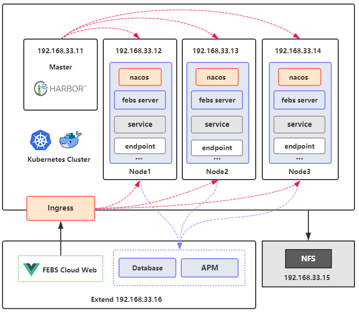

## FEBS-Cloud-K8S
FEBS Cloud Kubernetes部署脚本，基于K8S 1.16.2集群版本。

具体部署教程：[https://www.kancloud.cn/mrbird/spring-cloud/1426914](https://www.kancloud.cn/mrbird/spring-cloud/1426914)

Vagrant创建的虚机配置列表：

System | IP | Role| CPU cores | RAM| Hostname
---|---|---|---|---|---
CentOS 7| 192.168.33.11| Master| 2 | 2048M |master
CentOS 7| 192.168.33.12| Node1| 2 | 5120M |node1
CentOS 7| 192.168.33.13| Node2| 2 | 5120M |node2
CentOS 7| 192.168.33.14| Node3| 2 | 5120M |node3
CentOS 7| 192.168.33.15| NFS| 1 | 1024M |nfs
CentOS 7| 192.168.33.16| Extend| 2 | 7168M |extend

架构图：

