### FEBS Cloud 微服务权限系统


FEBS Cloud是一款使用Spring Cloud Hoxton.RELEASE、Spring Cloud OAuth2 & Spring Cloud Alibaba构建的低耦合权限管理系统，前端（FEBS Cloud Web）采用vue element admin构建。FEBS意指：**F**ast，**E**asy use，**B**eautiful和**S**afe。该系统具有如下特点：

序号 | 特点
---|---
1 | 前后端分离架构，客户端和服务端纯Token交互； 
2 | 认证服务器与资源服务器分离，方便接入自己的微服务系统
3 | 集成Prometheus，SpringBootAdmin，Skywalking APM
4 | 网关限流，网关黑名单限制，网关日志（WebFlux编程实践）
5 | 微服务Docker化，使用Docker Compose一键部署，K8S集群
6 | 社交登录，认证授权，数据权限，前后端参数校验，Starter开箱即用等
7 | Doc Starter，几行配置自动生成系统api接口文档
8 | OAuth2 4种模式+刷新令牌模式，提供5种获取系统令牌方式
9 | 提供详细的导入教程、使用教程和开发教程，对于想深入了解的用户还提供了搭建教程

### 文档与教程

> 在这浮躁的社会里，还请您耐心阅读文档，99%的问题在文档中都能找到答案。

文档 | 地址
---|---
项目导入教程 | [https://www.kancloud.cn/mrbird/spring-cloud/1647283](https://www.kancloud.cn/mrbird/spring-cloud/1647283)
管理页面使用教程 | [https://www.kancloud.cn/mrbird/spring-cloud/1647284](https://www.kancloud.cn/mrbird/spring-cloud/1647284)
二次开发教程 | [https://www.kancloud.cn/mrbird/spring-cloud/1265030](https://www.kancloud.cn/mrbird/spring-cloud/1265030)
项目从零搭建教程 | [https://www.kancloud.cn/mrbird/spring-cloud/1263685](https://www.kancloud.cn/mrbird/spring-cloud/1263685)
系统常见问题解答 | [https://mrbird.cc/FEBS-Cloud常见问题汇总.html](https://mrbird.cc/FEBS-Cloud常见问题汇总.html)
系统更新日志 | [https://www.kancloud.cn/mrbird/spring-cloud/1292659](https://www.kancloud.cn/mrbird/spring-cloud/1292659)

### 系统架构

<table>
  <tr>
    <td align="center" style="background: #fff"><b>FEBS Cloud</b></td>
  </tr>
  <tr>
    <td align="center" style="background: #fff">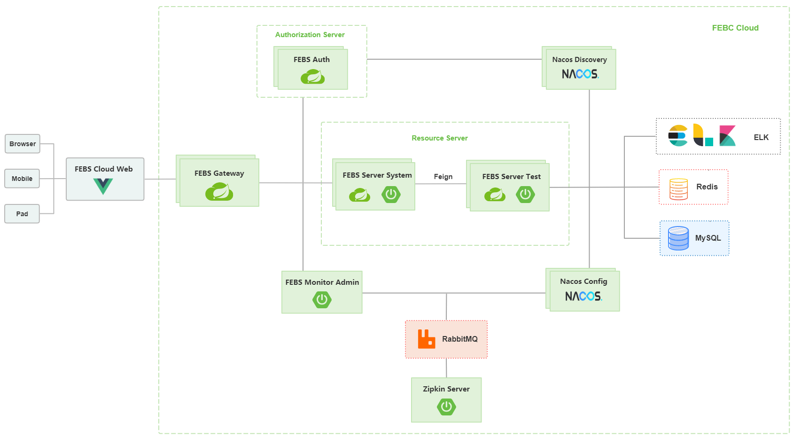</td>
  </tr>
  <tr>
  	<td align="center" style="background: #fff"><b>FEBS Prometheus APM</b></td>
  </tr>
  <tr>
  	<td align="center" style="background: #fff">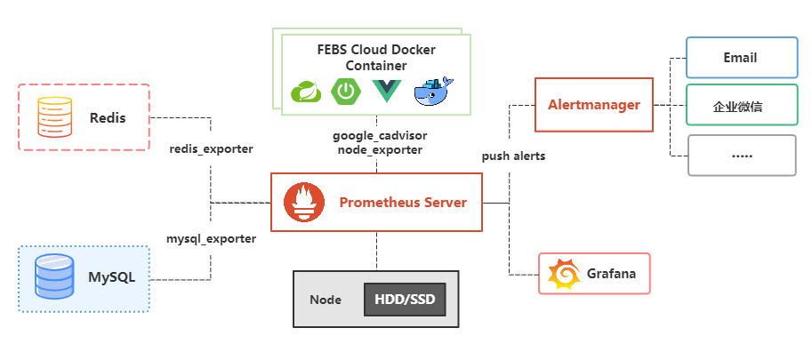</td>
  </tr>
   <tr>
    <td align="center" style="background: #fff"><b>FEBS Skywalking APM</b></td>
  </tr>
  <tr>
    <td align="center" style="background: #fff">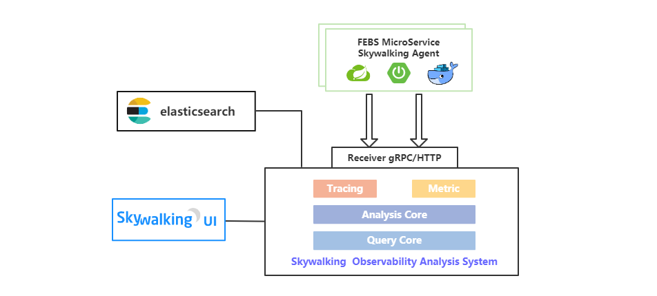</td>
  </tr>
   <tr>
    <td align="center" style="background: #fff"><b>FEBS Kubernetes</b></td>
  </tr>
  <tr>
    <td align="center" style="background: #fff">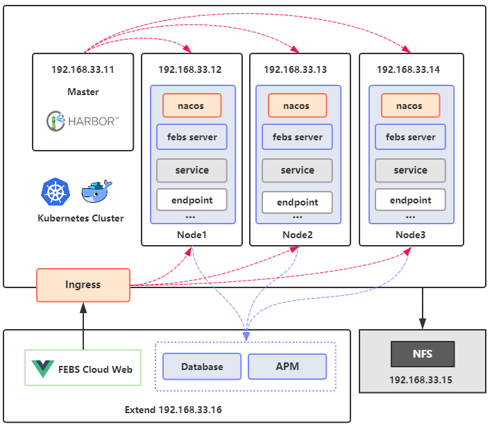</td>
  </tr>
</table>

### 项目地址

 平台  | FEBS Cloud（后端）|FEBS Cloud Web（前端）
---|---|---
GitHub | [https://github.com/wuyouzhuguli/FEBS-Cloud](https://github.com/wuyouzhuguli/FEBS-Cloud)|[https://github.com/wuyouzhuguli/FEBS-Cloud-Web](https://github.com/wuyouzhuguli/FEBS-Cloud-Web)
Gitee  | [https://gitee.com/mrbirdd/FEBS-Cloud](https://gitee.com/mrbirdd/FEBS-Cloud)|[https://gitee.com/mrbirdd/FEBS-Cloud-Web](https://gitee.com/mrbirdd/FEBS-Cloud-Web)

### 演示地址

演示地址：[https://cloud.mrbird.cn](https://cloud.mrbird.cn)

演示环境账号密码：

账号 | 密码| 权限
---|---|---
scott | 1234qwer | 注册账户，拥有查看权限

本地部署账号密码：

账号 | 密码| 权限
---|---|---
mrbird | 1234qwer |超级管理员，拥有所有增删改查权限
scott | 1234qwer | 注册账户，拥有查看，新增权限（新增用户除外）和导出Excel权限
jane | 1234qwer |系统监测员，负责整个系统监控模块

网关管理用户账号密码：

账号 | 密码| 权限
---|---|---
Jack | 123456 |网关管理模块查看权限
admin | 123456 |网关管理模块所有权限

APM平台相关账号密码：

平台 | 账号| 密码
---|---|---
febs-admin | febs |123456
febs-tx-manager | 无 | 123456
Grafana | febs | 123456

### 服务模块

FEBS模块：

服务名称 | 端口 | 描述
---|---|---
FEBS-Auth| 8101| 微服务认证服务器 
FEBS-Server-System| 8201 | 微服务子系统，系统核心模块
FEBS-Server-Test|8202 | 微服务子系统，Demo模块
FEBS-Server-Generator|8203 | 微服务子系统，代码生成模块
FEBS-Server-Job|8204 | 微服务子系统，任务调度模块
FEBS-Gateway|8301|微服务网关
FEBS-Admin|8401|微服务监控子系统
FEBS-Tx-Manager|8501|微服务分布式事务控制器

第三方模块：

服务名称 | 端口 | 描述
---|---|---
Nacos| 8001 |注册中心，配置中心 
MySQL| 3306 |MySQL 数据库 
Redis| 6379 | K-V 缓存数据库 
Elasticsearch|9200 | 日志存储
Logstash|4560|日志收集
Kibana|5601|日志展示
Prometheus|8403~8409|Prometheus APM
Skywalking|11800、12800、8080|Skywalking APM

### 目录结构
```
├─febs-apm                        ------ 微服务APM模块
│  ├─febs-admin                   ------ 微服务监控中心
│  ├─prometheus-grafana           ------ prometheus grafana apm相关配置，docker文件
│  └─skywalking-elk               ------ skywalking elk相关配置，docker文件
├─febs-auth                       ------ 微服务认证服务器
├─febs-cloud                      ------ 整个项目的父模块
│  ├─sql                          ------ SQL脚本
│  ├─postman                      ------ postman脚本
│  └─docker compose               ------ 项目相关docker compose文件
├─febs-common                     ------ 通用模块
│  ├─febs-common-core                   ------ 系统核心依赖包
│  ├─febs-common-datasource-starter     ------ 系统数据库自动装配starter
│  ├─febs-common-doc                    ------ 文档模块的核心依赖包
│  ├─febs-common-doc-gateway-starter    ------ 网关聚合微服务子系统api文档自动装配starter
│  ├─febs-common-doc-starter            ------ 微服务子系统api文档自动装配starter
│  ├─febs-common-redis-starter          ------ 系统Redis自动装配starter
│  └─febs-common-security-starter       ------ 微服务子系统安全配置自动装配starter
├─febs-gateway                    ------ 微服务网关
├─febs-server                     ------ 微服务子系统
│  ├─ebs-server-system            ------ 微服务子系统系统核心模块
│  ├─febs-server-test             ------ 微服务子系统demo模块
│  ├─febs-server-generator        ------ 微服务子系统代码生成模块
│  └─febs-server-job              ------ 微服务子系统任务调度模块
└─febs-tx-manager                 ------ 微服务分布式事务控制器
```
### 系统截图

<table>
  <tr>
     <td>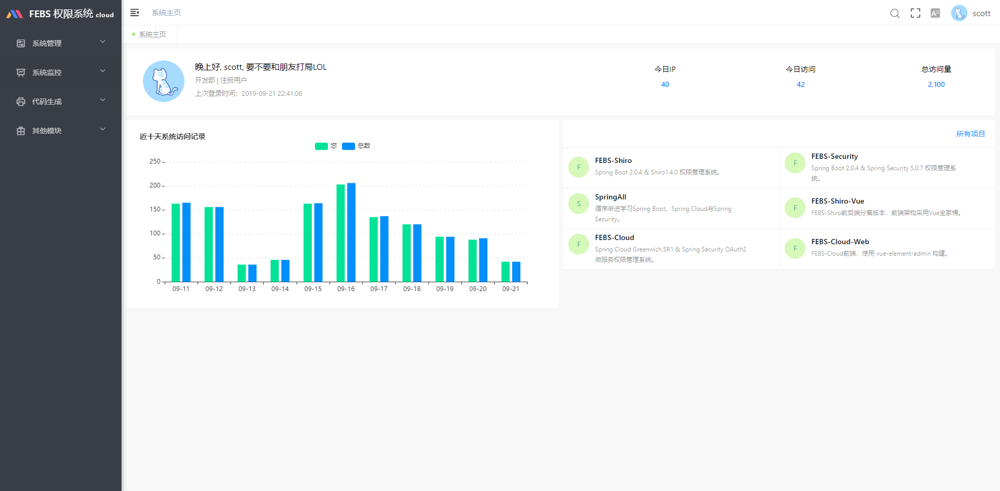</td>
     <td>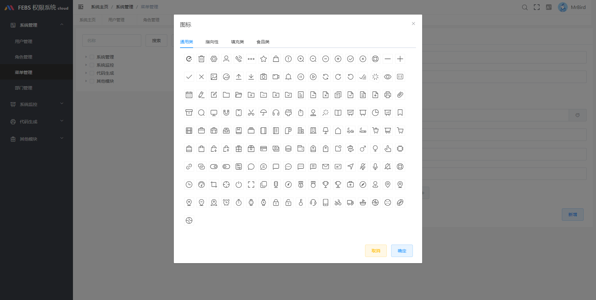</td>
  </tr>
  <tr>
     <td>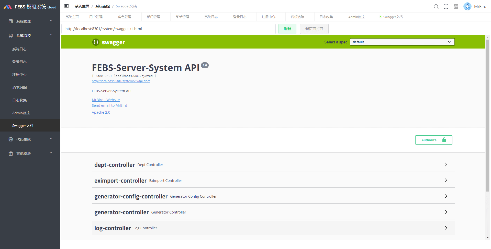</td>
     <td>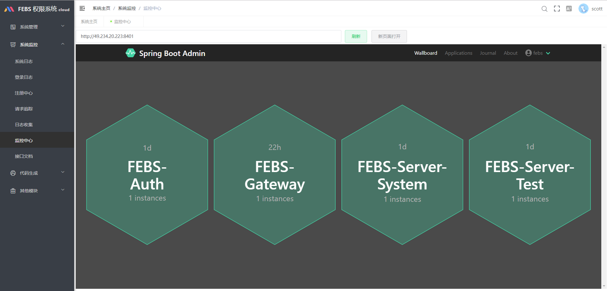</td>
  </tr>
  <tr>
     <td>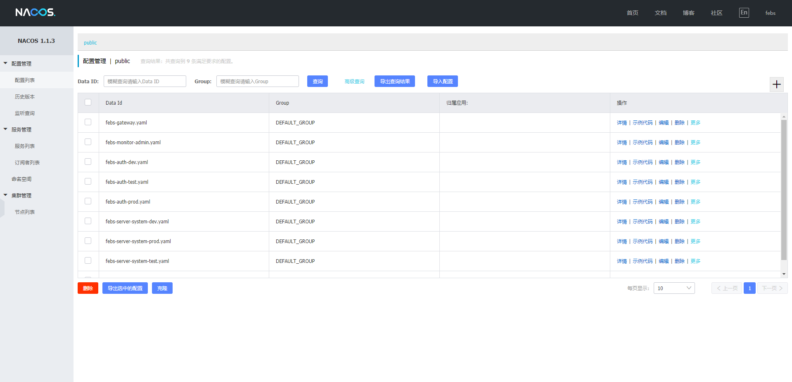</td>
     <td>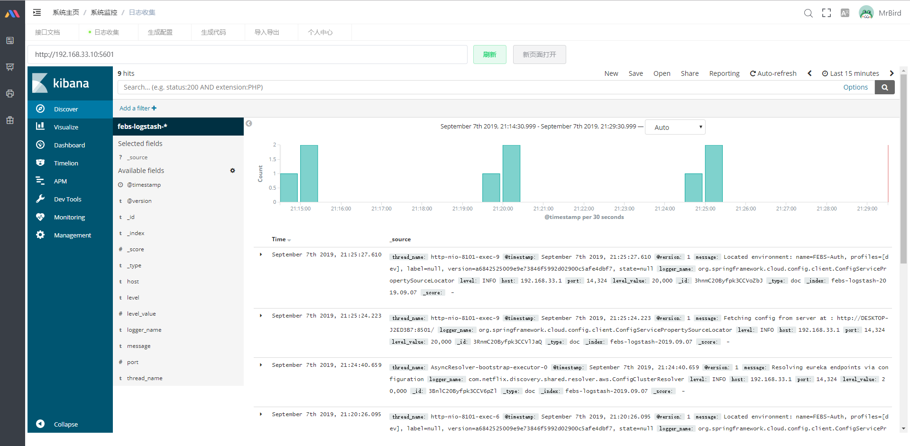</td>
  </tr>
  <tr>
     <td>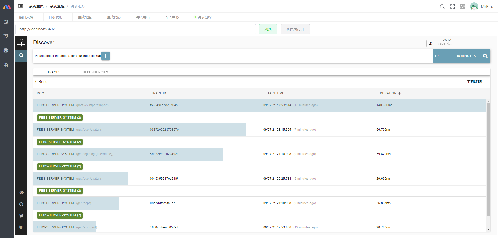</td>
  </tr>
</table>

### 服务APM

#### [Prometheus APM](http://cloud.mrbird.cn:8404)

<table>
  <tr>
     <td width="100%" align="center"><b>JVM监控</b></td>
  </tr>
  <tr>
     <td>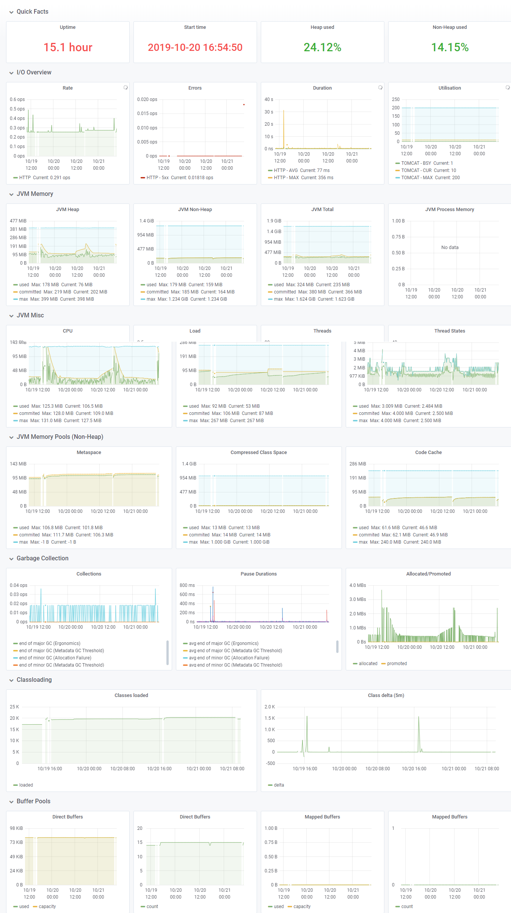</td>
  </tr>
  <tr>
  	<td width="100%" align="center"><b>MySQL监控</b></td>
  </tr>
  <tr>
  	<td></td>
  </tr>
   <tr>
     <td width="100%" align="center"><b>Docker容器监控</b></td>
  </tr>
  <tr>
     <td>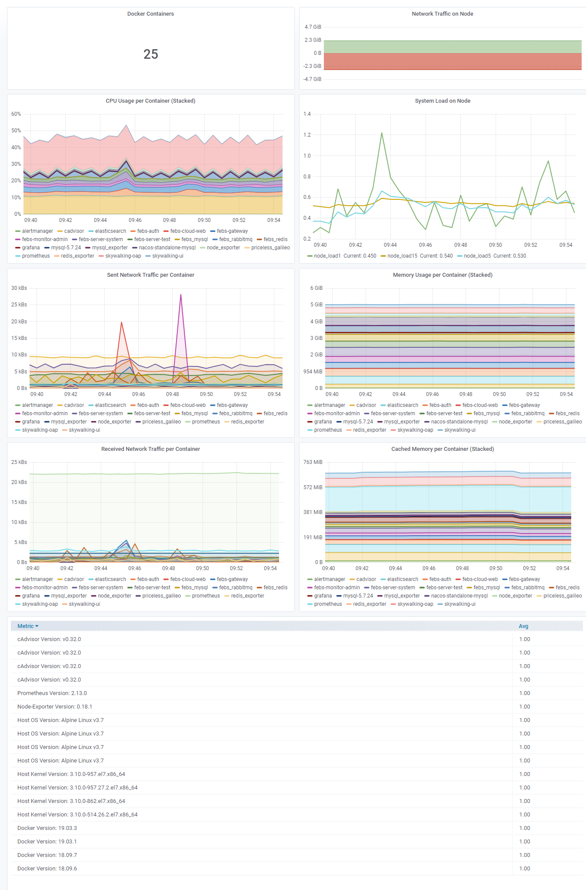</td>
  </tr>
  <tr>
  	<td width="100%" align="center"><b>Redis监控</b></td>
  </tr>
  <tr>
  	<td>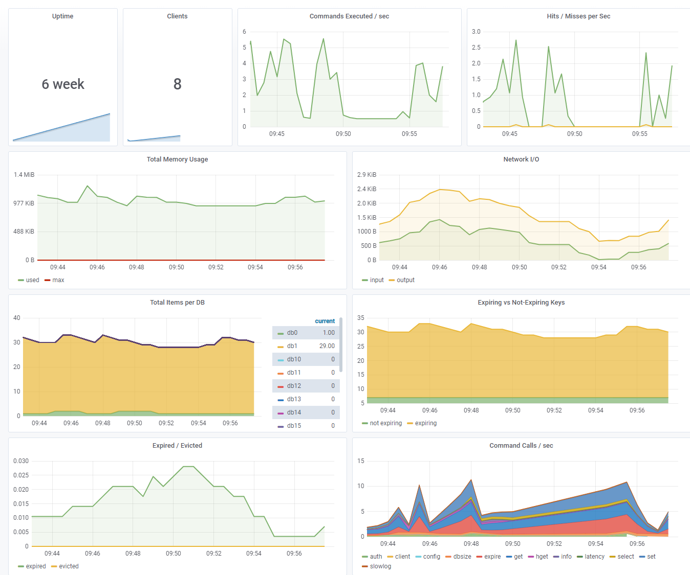</td>
  </tr>
</table>

#### [Skywalking APM](http://123.206.206.203:8080/)

<table>
  <tr>
     <td width="50%" align="top">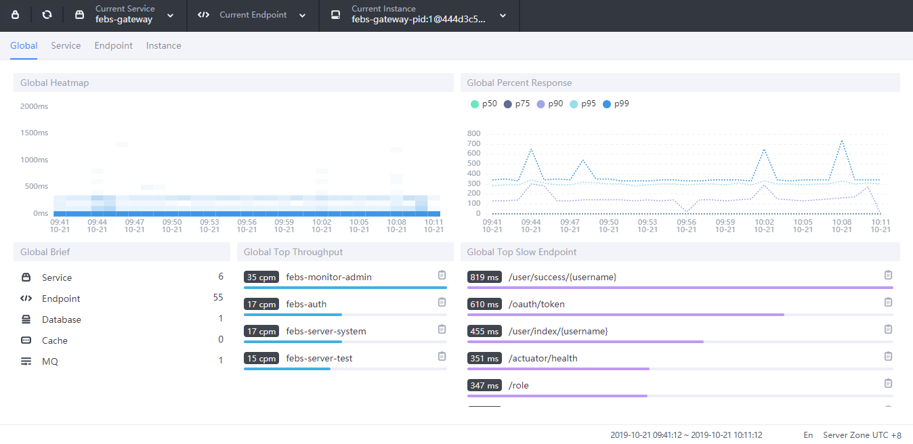</td>
     <td width="50%" align="top">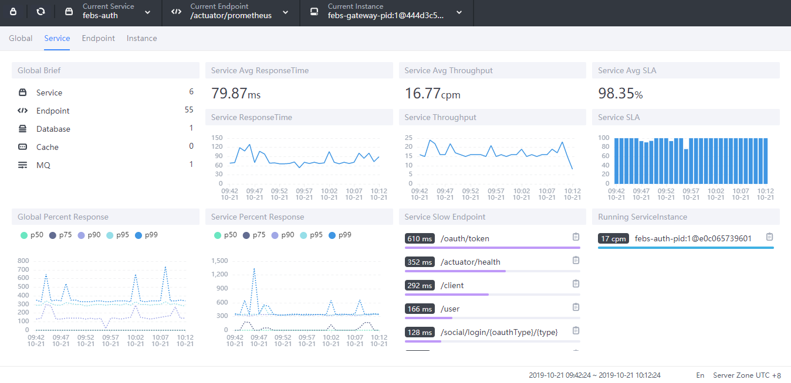</td>
  </tr>
  <tr>
     <td width="50%" align="top"></td>
     <td width="50%" align="top">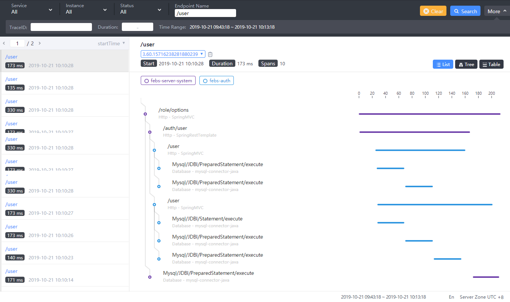</td>
  </tr>
</table>


### 参与贡献
欢迎提交PR一起完善项目，以下为提PR并合并的小伙伴（排名不分先后）：

<a href="https://github.com/yuuki80code">
    </a>
<a href="https://github.com/sonake">
    </a>
<a href="https://github.com/mgzu">
    </a>
<a href="https://github.com/liuzhuoming23">
    </a>

<a href="https://github.com/xuefrye">
    </a>

### 反馈交流

加入QQ群和大家一起~~交流~~吹水：


