### 已停止维护


FEBS-Security是一个简单高效的后台权限管理系统。项目基础框架采用全新的Java Web开发框架 —— Spring Boot2.0.4，消除了繁杂的XML配置，使得二次开发更为简单；数据访问层采用Mybatis，同时引入了通用Mapper和PageHelper插件，可快速高效的对单表进行增删改查操作，消除了大量传统XML配置SQL的代码；安全框架采用Spring Security 5.0.7，可实现对按钮级别的权限控制，并集成了社交账户登录（QQ和微信）以及手机验证码登录；前端页面使用Bootstrap构建，主题风格为时下Google最新设计语言Material Design，并提供多套配色以供选择。FEBS意指：Fast，Easy use，Beautiful和Safe。

[项目文档](https://security.mrbird.cc/)

## 功能模块

```
|-------------------------------------------|
|    ______ ______ ____   _____             |
|   |  ____|  ____|  _ \ / ____|            |
|   | |__  | |__  | |_) | (___              |
|   |  __| |  __| |  _ < \___ \             |
|   | |    | |____| |_) |____) |            |
|   |_|    |______|____/|_____/             |
|                                           |
|   Spring-Boot-Version: 2.0.4.RELEASE      |
|   Spring-Security-Version: 5.0.7.RELEASE  |
|-------------------------------------------|
├─系统管理
│  ├─字典管理
│  ├─用户管理
│  ├─菜单管理
│  ├─角色管理
│  └─部门管理
├─系统监控
│  ├─在线用户
│  └─系统日志
├─任务调度
│  ├─定时任务
│  └─调度日志
└─网络资源
    ├─天气查询
    ├─影视资讯
    │  ├─即将上映
    │  └─正在热映
    └─每日一文
```


## 技术选型

### 后端

- 基础框架：Spring Boot 2.0.4.RELEASE
- 持久层框架：Mybatis 3.4.5
- 安全框架：Spring Security 5.0.7
- 摸板引擎：Thymeleaf 3.0.9.RELEASE
- 数据库连接池：Hikari
- 缓存框架：Redis
- 日志打印：logback
- 其他：Spring Social，Spring OAuth2，fastjson，poi，javacsv，quartz等。

### 前端
- 基础框架：Bootstrap 4
- JavaScript框架：jQuery
- 消息组件：Bootstrap notify
- 提示框插件：SweetAlert2
- 树形插件：jsTree
- 树形表格插件：jqTreeGrid
- 表格插件：BootstrapTable
- 表单校验插件：jQuery-validate
- 多选下拉框插件：multiple-select
- 图表插件：Highcharts
- 时间插件：daterangepicker

### 开发环境
- 语言：Java 8
- IDE：Eclipse Oxygen & IDEA 2018.1.4(Ultimate Edition)
- 依赖管理：Maven
- 数据库：MySQL5.7
- 版本管理：SVN，git

## 模块说明
系统分为以下五个模块：
<table>
<tr>
	<th>模块</th>
	<th>说明</th>
</tr>
<tr>
	<td>febs-common</td>
	<td>基础模块，主要包含一些工具类，基础配置</td>
</tr>	
<tr>
	<td>febs-system</td>
	<td>系统模块，增删改查服务</td>
</tr>
<tr>
	<td>febs-quartz</td>
	<td>任务调度模块，处理定时任务</td>
</tr>
<tr>
	<td>febs-security</td>
	<td>安全模块，和安全有关的都在这个模块里</td>
</tr>
<tr>
	<td>febs-web</td>
	<td>web模块，包含前端部分和控制层</td>
</tr>
</table>	

## 系统预览

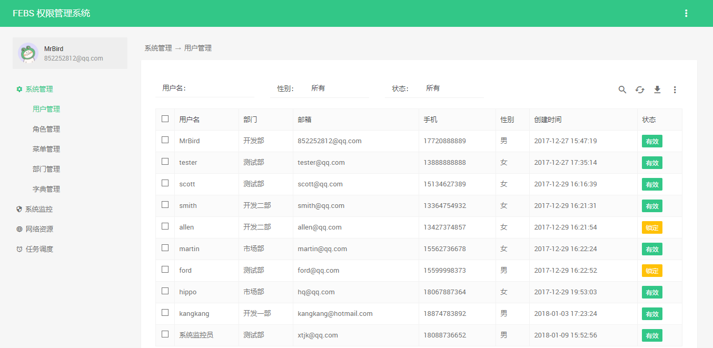

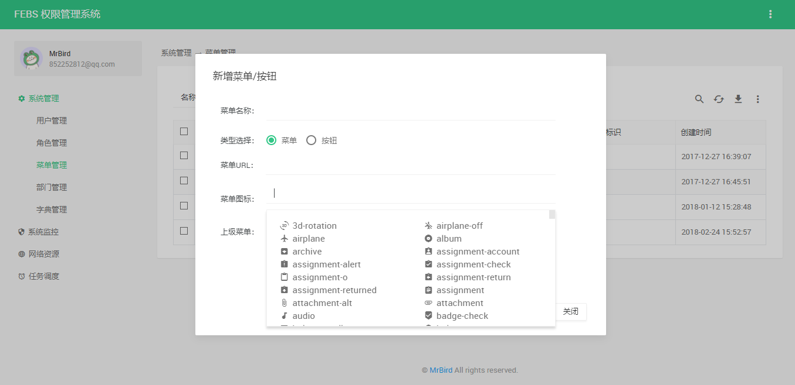

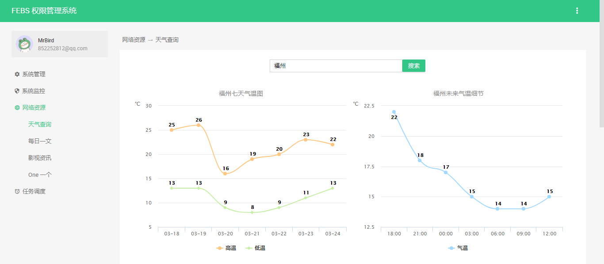

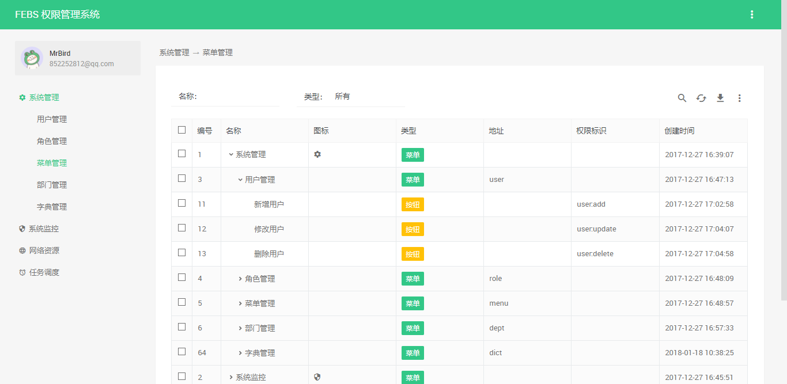


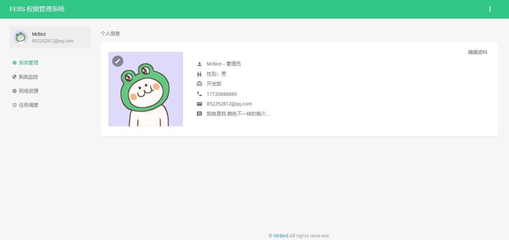

## 主题预览

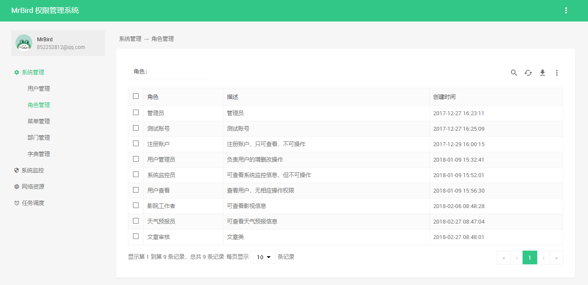

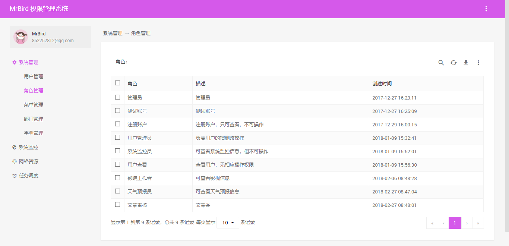

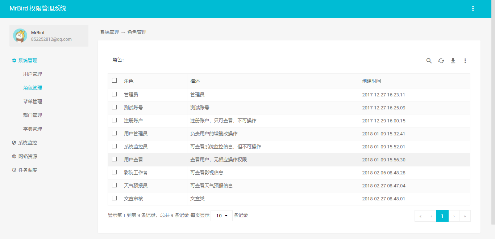

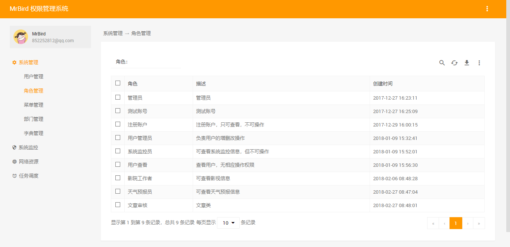

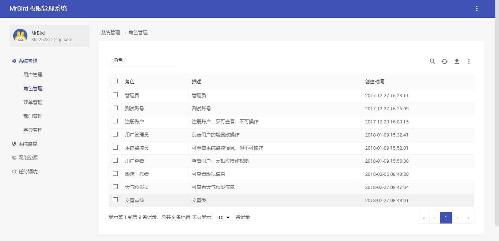

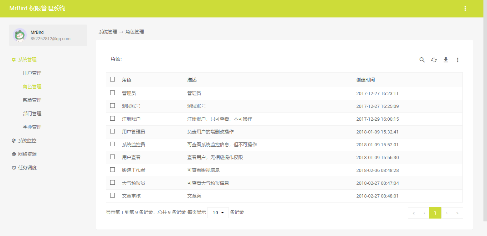

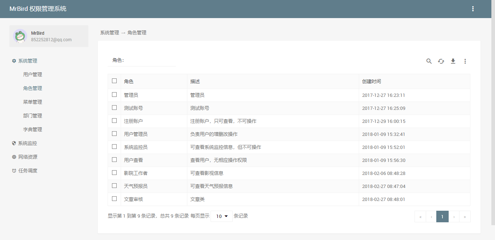

## 更新日志
**2018年11月26日 by[liuliuzx](https://github.com/liuliuzx)**

新增thymeleaf自定义数据字典方言标签，具体使用方法：

```
<dict:show fieldName="ssex" keyy="1"></dict:show>
<dict:select fieldName="ssex"  name="type" keyy="1" class="form-control" id="ssex"></dict:select>
```

