<div align="center">
<br/>

  <h1 align="center">
    Pear Admin Boot
  </h1>
  <h4 align="center">
    开 箱 即 用 的 Spring 快 速 开 发 平 台
  </h4> 

  [预 览](http://boot.pearadmin.com)   |   [官 网](http://www.pearadmin.com/)   |   [群聊](https://jq.qq.com/?_wv=1027&k=5OdSmve)   |   [社区](http://forum.pearadmin.com/) | [更新](http://forum.pearadmin.com/posts/fb16cb02ba2347a6ac236c434e07f8e1/detail)
</div>

<p align="center">
    <a href="#">
        
    </a>
    <a href="#">
        
    </a>
      <a href="#">
        
    </a>
    <br/>
    <a href="#">
        
    </a>
</p>

<div align="center">
  
</div>

#### 项目介绍  :jack_o_lantern: 

Spring Boot + Security + MyBatis + Thymeleaf + Activiti 快速开发平台

 项目不定时更新，建议 Star watch 一份

#### 模块划分

|功能名称     |实现方式     |完成度     |功能名称     |实现方式     |完成度     |
| --- | --- | --- | --- | --- | --- |
|核心框架     |Spring Boot     |已完成     |接口文档     |Swagger     |已完成     |
|权限管理     |Spring Security     |已完成     |定时任务     |Quartz     |已完成     |
|流程控制     |Activiti     |已完成     |代码生成     |MyBatis Plus     |已完成     |

#### 内置功能

1.  用户管理：用户是系统操作者，该功能主要完成系统用户配置。
2.  权限管理：配置系统菜单，操作权限，按钮权限标识等。
3.  角色管理：角色菜单权限分配、设置角色按机构进行数据范围权限划分。
4.  字典管理：对系统中经常使用的一些较为固定的数据进行维护。
5.  参数管理：对系统动态配置常用参数。
6.  通知公告：系统通知公告信息发布维护。
7.  操作日志：系统正常操作日志记录和查询；系统异常信息日志记录和查询。
8.  登录日志：系统登录日志记录查询包含登录异常。
9.  定时任务：在线（添加、修改、删除)任务调度包含执行结果日志。
10. 代码生成：前后端代码的生成（java、html、xml、sql）支持CRUD下载 。
11. 系统接口：根据业务代码自动生成相关的api接口文档。
12. 服务监控：监视当前系统CPU、内存、磁盘、堆栈等相关信息。
13. 快捷部署：提供 Deploy 脚本，支持快速部署
14. 在线构建器：拖动表单元素生成相应的HTML代码。
15. 连接池监视：监视当前系统数据库连接池状态，可进行分析SQL找出系统性能瓶颈。


#### 项目结构

```
Pear Admin Boot
│
├─annex  项目SQL文件
│
├─pear-common 公共模块
│  │
│  ├─config 框架集成配置
│  │
│  ├─constant 通用常量
│  │
│  ├─exception 异常处理
│  │
│  ├─plugins 封装组件
│  │
│  ├─tools 工具类
│  │
│  └─web WEB 处理封装
│
├─pear-entrance 启动模块
│  │
│  ├─api 通用接口
│  │
│  ├─secure 安全框架
│  │
│  └─EntranceApplication 启动类
│
├─pear-entrance 启动模块
│  │
│  ├─static 静态资源
│  │
│  ├─templates 页面文件
│  │
│  ├─logback-spring.xml 日志配置
│  │
│  ├─application-dev.yml 开发环境配置
│  │
│  ├─application-prod.yml 线上环境配置
│  │
│  ├─application-test.yml 测试环境配置
│  │
│  └─application.yml 配置文件
│
├─pear-modules 业务模块
│  │
│  ├─pear-generator 代码生成
│  │
│  ├─pear-system 系统业务
│  │
│  ├─pear-schedule 定时任务
│  │
│  └─pear-process 工作流程
│  
└─pom.xml  Maven 配置

```

#### 快速上手

##### 下载

```
git clone https://gitee.com/pear-admin/Pear-Admin-Boot.git

```

##### 配置

[开发配置](https://gitee.com/pear-admin/Pear-Admin-Boot/blob/master/pear-entrance/src/main/resources/application-dev.yml)

[生产配置](https://gitee.com/pear-admin/Pear-Admin-Boot/blob/master/pear-entrance/src/main/resources/application-prod.yml)


#### 开源共建

1. 欢迎提交 [pull request](https://gitee.com/pear-admin/Pear-Admin-Boot/pulls)，注意对应提交对应 `master` 分支

2. 欢迎提交 [issue](https://gitee.com/pear-admin/Pear-Admin-Boot/issues)，请写清楚遇到问题的原因、开发环境、复显步骤。

#### 预览项目

| |  |
|---------------------|---------------------|
| 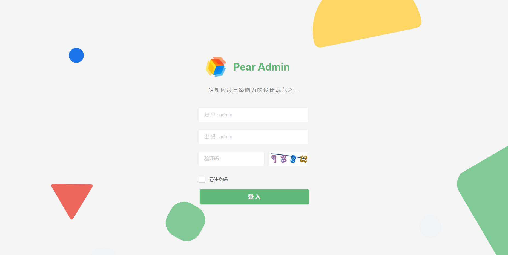  |   |
| 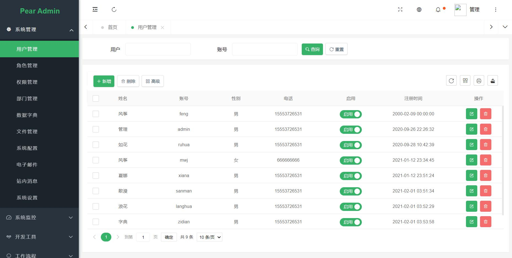 | 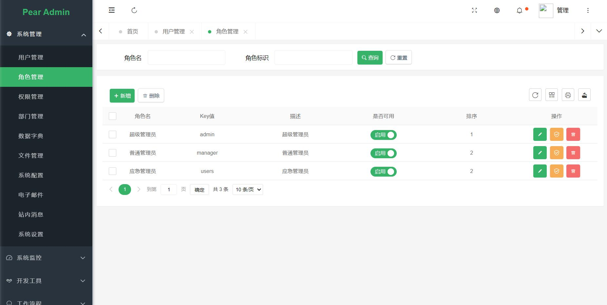  |
| 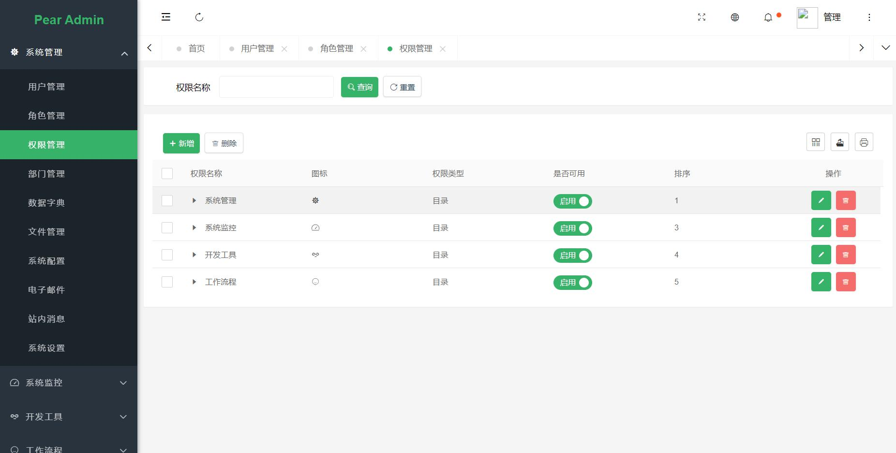 | 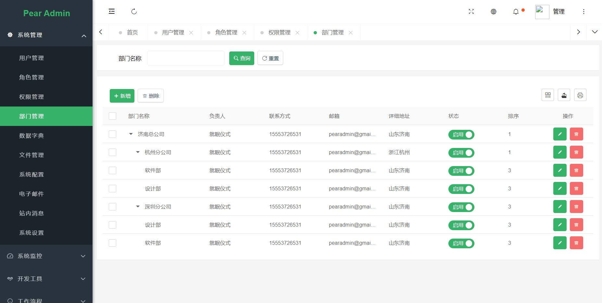  |
| 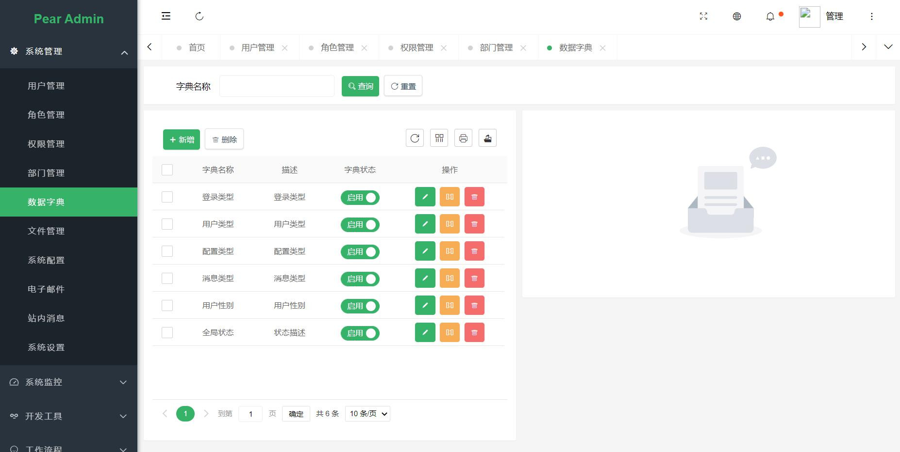 | 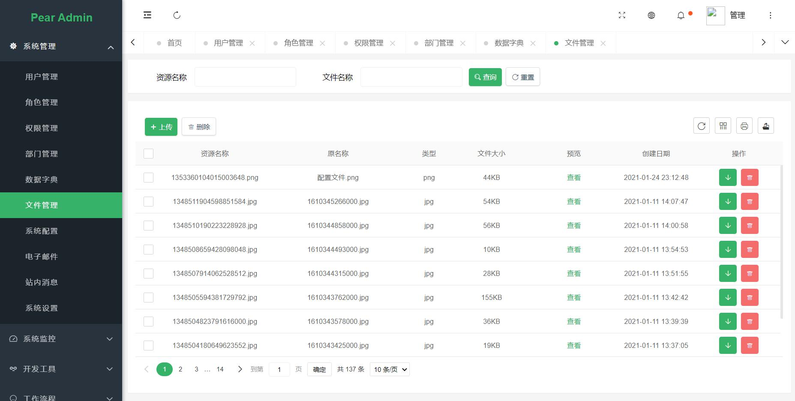 |
| 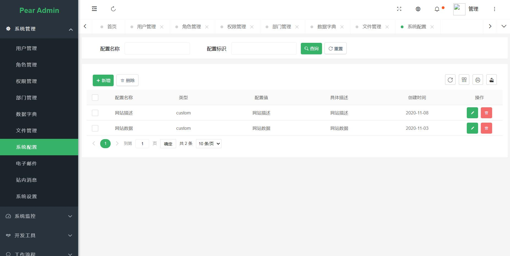 | 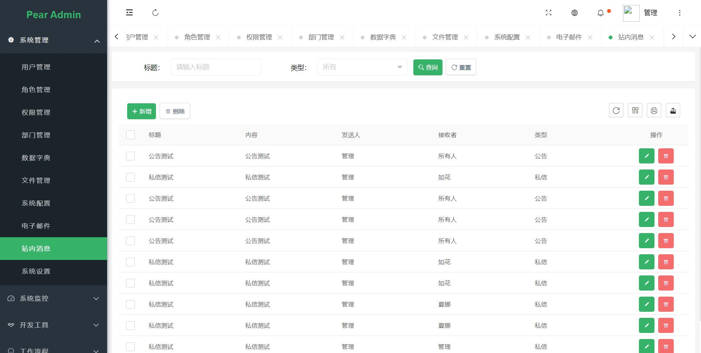 |
|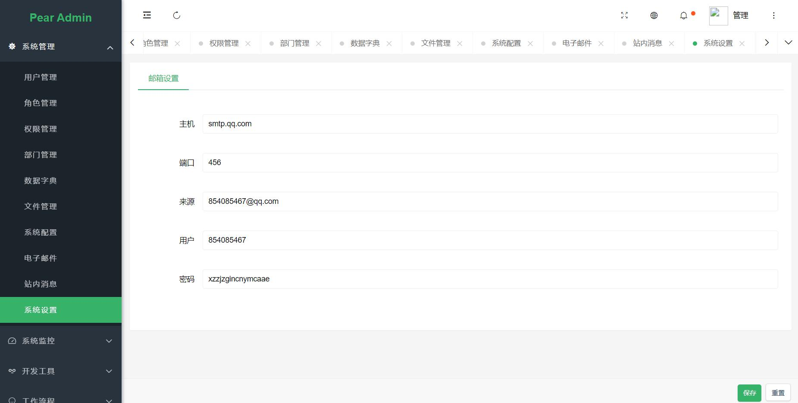 | 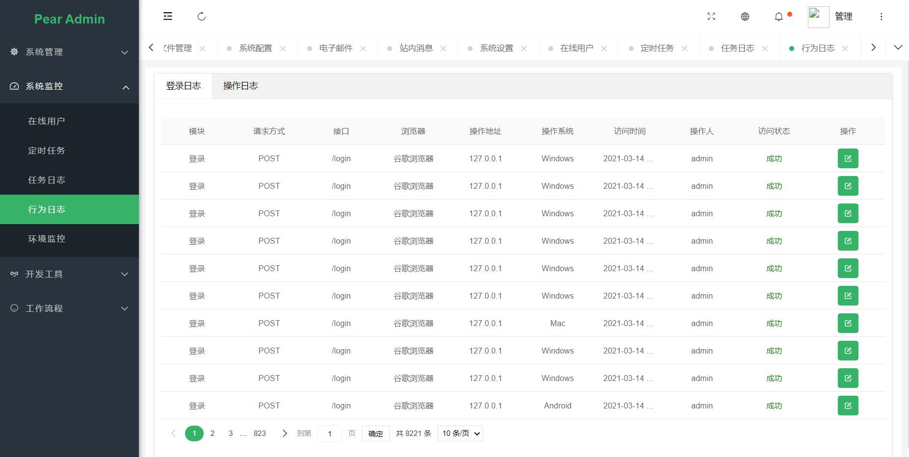 |
|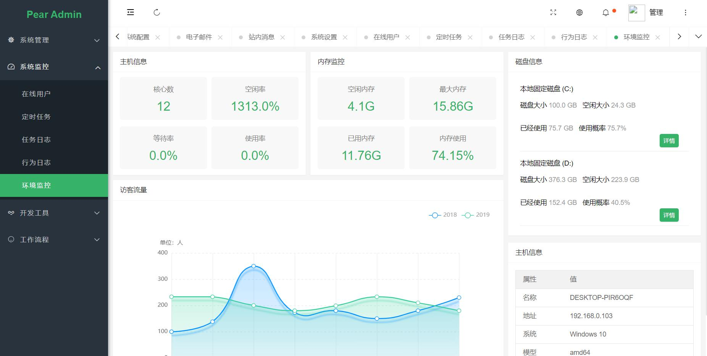 | 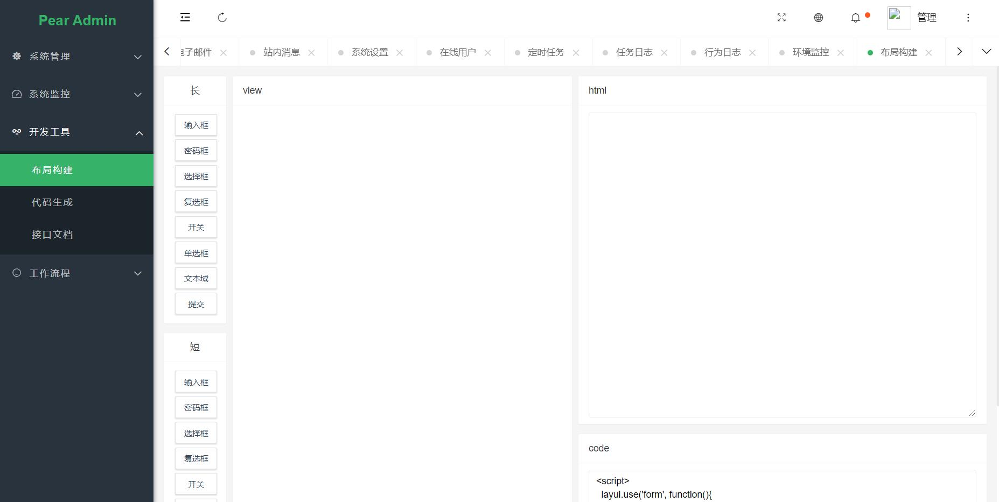 |
|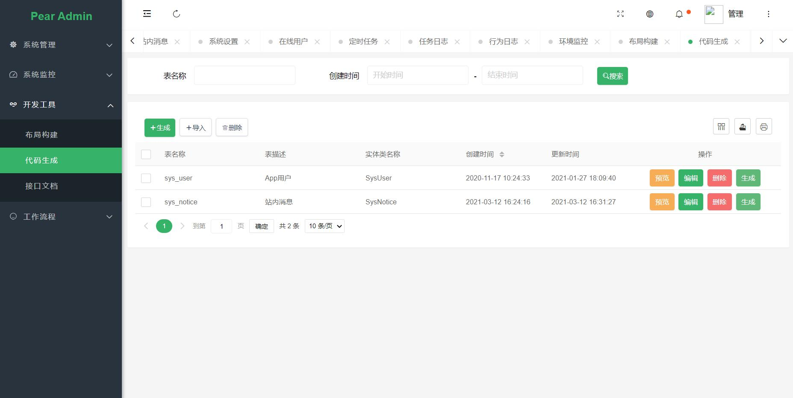 |  |
|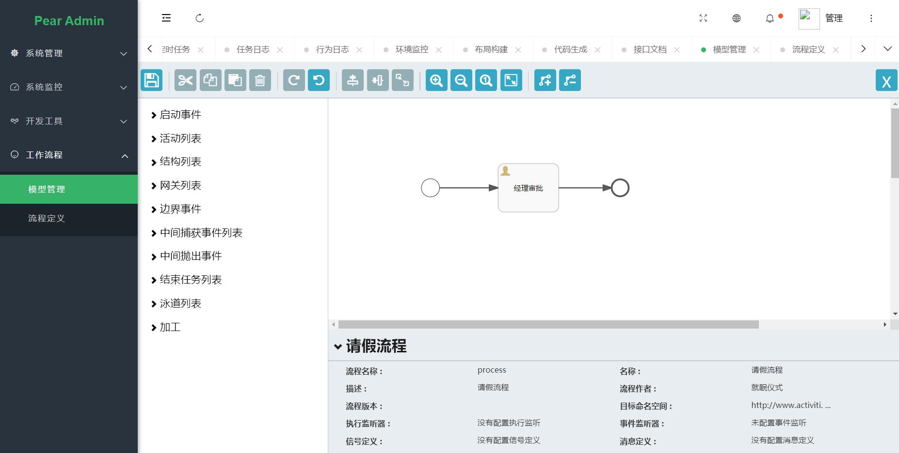 | 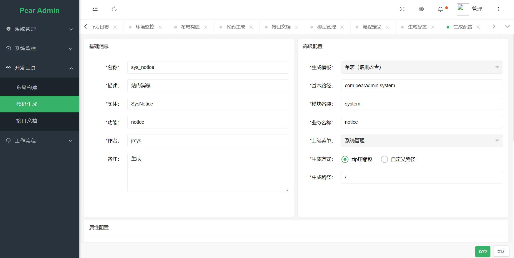|


