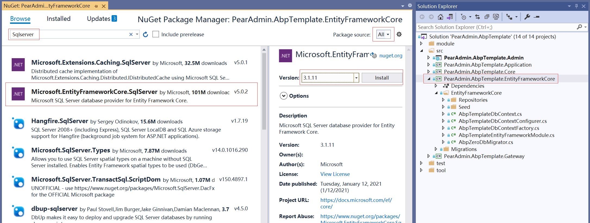
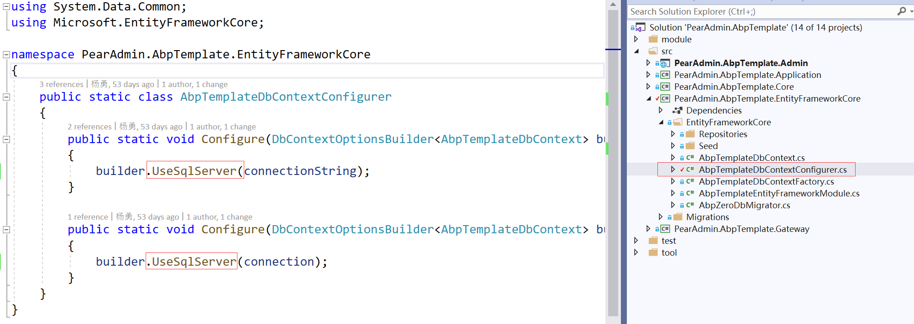
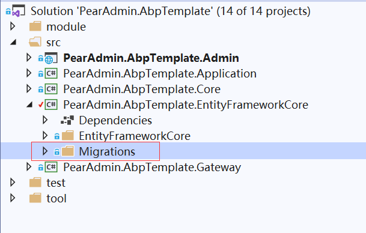
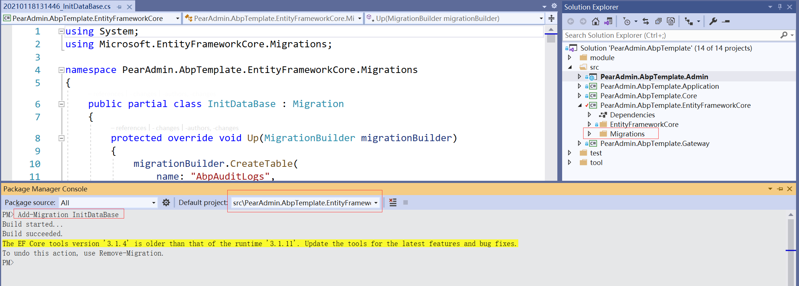
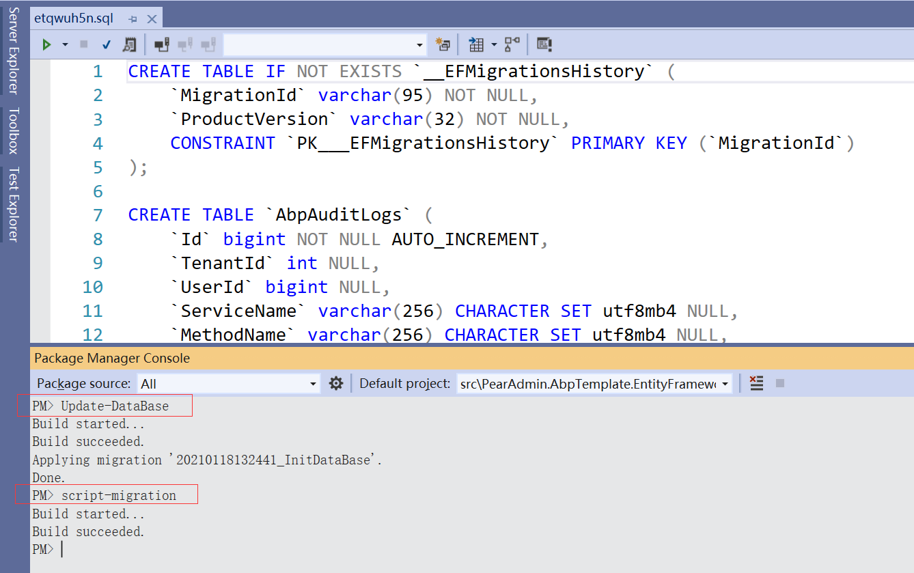

## 数据驱动包  :id=package
选择EF Core,进入包管理器更换其驱动包，搜索并选择相应的包，如此处选择SQLserver安装。当前Core版本为3.1

## 更换配置  :id=config
更换DbContextConfigurer中设置，选择切换到SqlServer

## 移除迁移  :id=removemigration
由于使用库本身有点差异，清理或是删除下现有迁移文件

## 新增迁移  :id=addmigration
包管理器控制台中重新添加迁移,注意配置连接字符串，及选择包管理器控制台中选择默认项目为EFCore的

## 应用迁移  :id=applymigration
包管理器控制台中执行命令，将迁移应用到数据库中，使用Update-DataBase直接应用到数据库，或是使用Script-Migration生成SQL到数据库中执行
