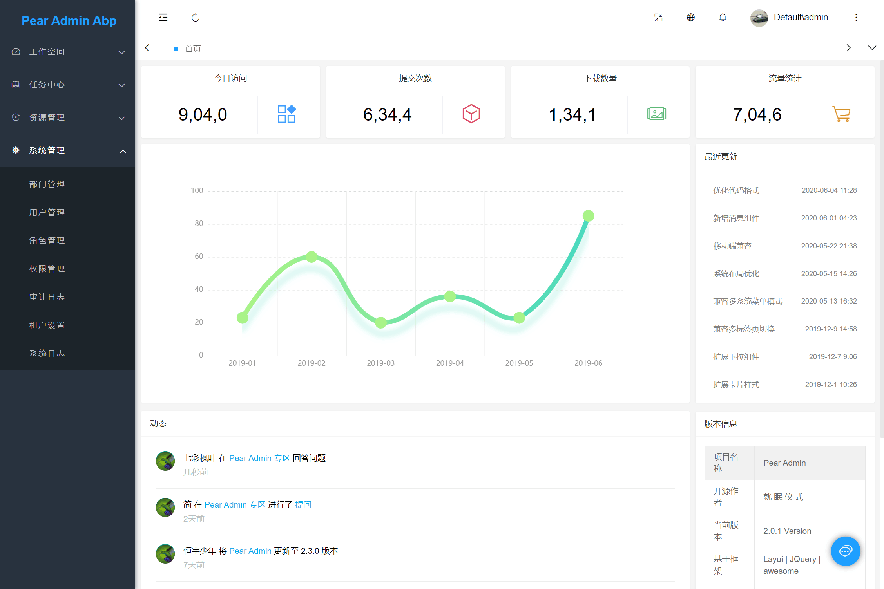
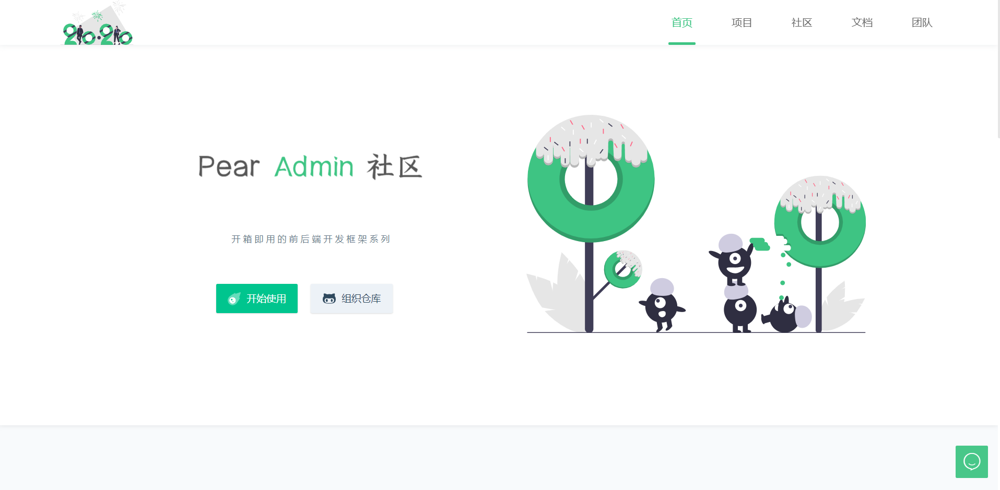
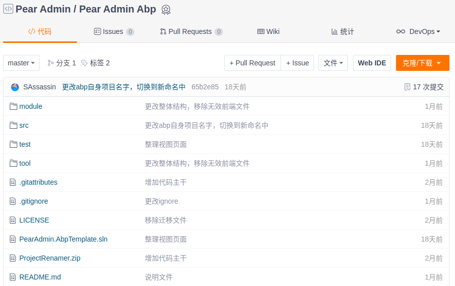

## 项目介绍  :id=start

Pear Admin Abp 基于 AspNetBoilerplate 的快速开发平台，使用Layui作为前端呈现，封装常用的功能。旨在设计快速入手，快速实践框架。

> 当前版本：`Release v1.1.0`，查看 [在线演示](http://net.pearadmin.com)。
 

## 下载使用  :id=download

#### 1. 官网地址

官网提供稳定版本的 Release 发行版本 [前往](http://www.pearadmin.com)

#### 2. 源码仓库

如果你需要最新代码，请前往 Gitee 仓库 [前往](https://gitee.com/pear-admin/pear-admin-abp.git)

