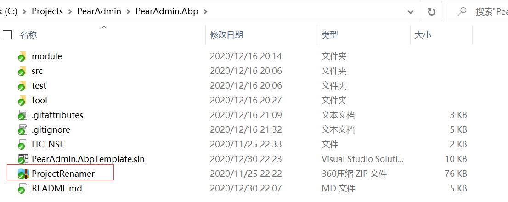
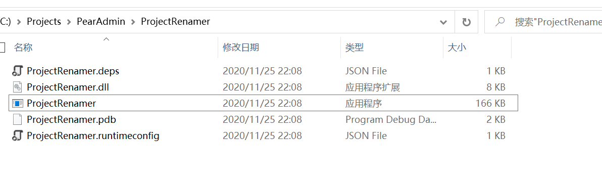
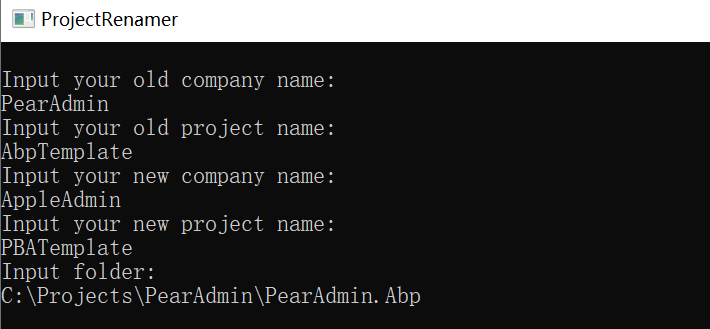

## 项目重命名  :id=config
在根目录下，提供了一个ProjectRenamer的压缩包

将其移出当前目录到其他目录下，解压查看

点击exe文件，控制台内输入当前项目名及期望项目名(默认当前命名为PearAdmin.AbpTemplate)

如此处将PearAdmin.AbpTemplate更名为AppleAdmin.PBATemplate，最后指定项目根路径，回车后开始将原有项目更名