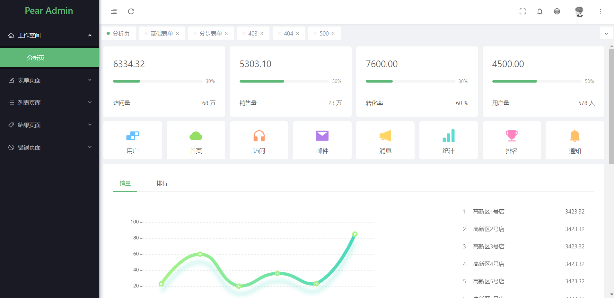
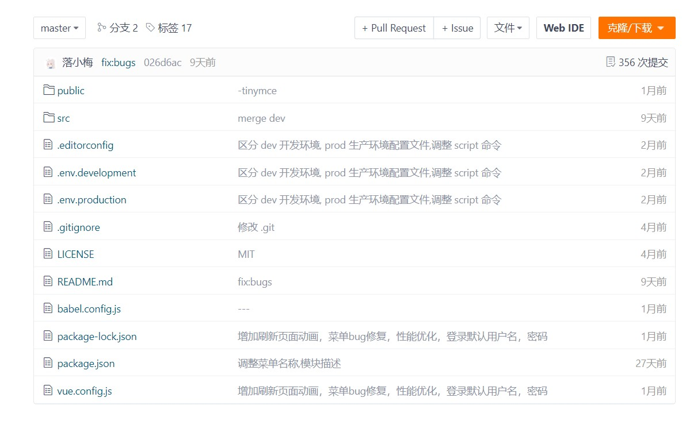
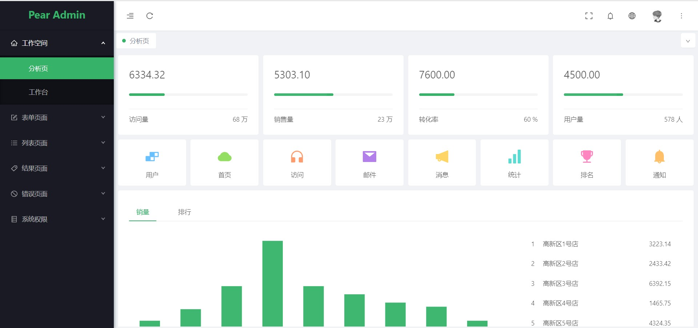
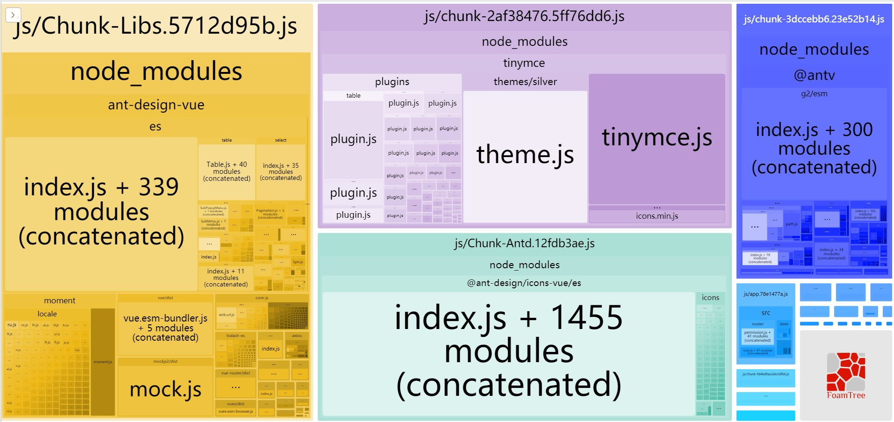

## 介绍  :id=start

Pear Admin Ant 是一个快速，简介且高效的中后台前端/设计解决方案，使用 Ant Design Vue 开发

> 当前版本：`Release v1.2.0`，查看 [在线演示](http://ant.pearadmin.com)。




## 下载  :id=download


#### 1. 官网地址

官网提供稳定版本的 Release 发行版本 [前往](http://www.pearadmin.com)


#### 2. 源码仓库

如果你需要最新代码，请前往 Gitee 仓库 [前往](https://gitee.com/pear-admin/pear-admin-ant)




## 安装  :id=install

```bash
# 确保已经完成克隆项目或者下载了发行版本
git clone https://gitee.com/pear-admin/pear-admin-ant.git

# 进入项目目录
cd pear-admin-ant

# 安装依赖
npm install

# 建议不要使用 cnpm 安装 可能会有各种问题 可以通过指定淘宝源的方法解决 npm 下载速度慢的问题
npm install --registry=https://registry.npm.taobao.org

# 以开发环境启动项目
npm run servey-dev
# 或者
# 以生成环境启动项目
npm run serve-prod
```

启动项目成功后会自动打开浏览器访问 http://localhost:8080  你看到下面的页面就代表操作成功了。




## 构建  :id=build

```bash
#以开发环境构建
npm run build-dev
#以生成环境构建
npm run build-prod

```

打包并生成分析图

```
npm run report
```



## 部署  :id=deploy

对于发布来讲，只需要将最终生成的静态文件，也就是通常情况下 `dist` 文件夹的静态文件发布到你的 cdn 或者静态服务器即可，需要注意的是其中的 `index.html` 通常会是你后台服务的入口页面，在确定了 js 和 css 的静态之后可能需要改变页面的引入路径。

TIP

部署时可能会发现资源路径不对 ,只需修改 `vue.config.js` 文件资源路径即可。

```js
publicPath: './' //请根据自己路径来配置更改
```