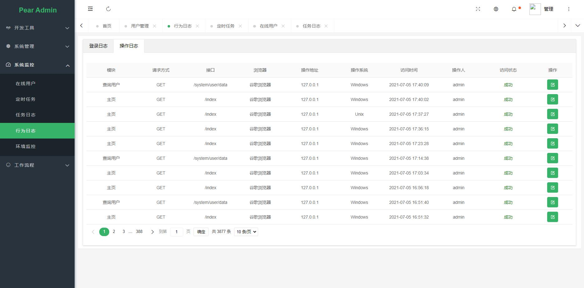
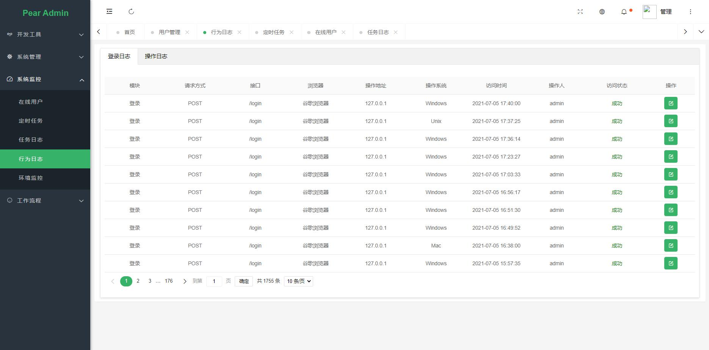

## 系统日志

本系统使用 AOP 方式记录用户操作日志，只需要在 controller 的方法上使用 @Logging("") 注解，就可以将用户操作记录到数据库，源码可查看 common/plugins/logging 目录

```
	@DeleteMapping("batchRemove/{ids}")
    @ApiOperation(value = "批量删除用户")
    @PreAuthorize("hasPermission('/system/user/remove','sys:user:remove')")
    @Logging(title = "删除用户", describe = "删除用户", type = BusinessType.REMOVE)
    public Result batchRemove(@PathVariable String ids) {
        boolean result = sysUserService.batchRemove(ids.split(","));
        return decide(result);
	}
```

## 操作日志





## 登录日志

