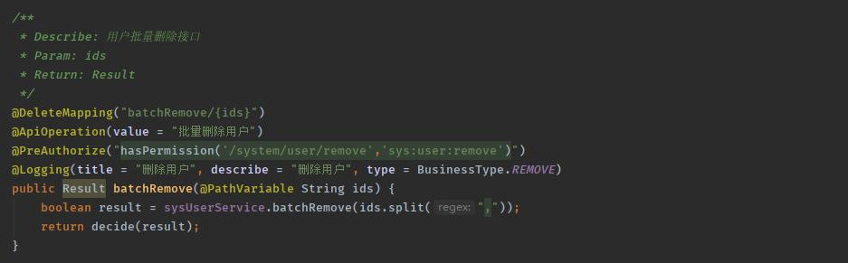
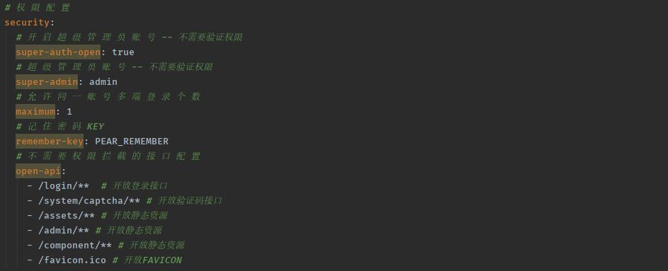

## 访问控制

本系统是 RBAC 模型的权限管理，权限关系由 sys-user sys-user-role sys-role sys-role-power sys-power 五张表来管理权限关系

当用户访问系统时，提取用户所拥有的权限列表，放入当前 WEB 上下文中



使用 @PreAuthorize 注解限制访问，当前用户为拥有相应权限时，会抛出响应异常

## 前端控制

在前端开发中，用户未拥有的权限操作都应隐藏

```

<button sec:authorize="hasPermission('/system/user/add','sys:user:add')" class="pear-btn pear-btn-primary pear-btn-md" lay-event="add">
    <i class="pear-icon pear-icon-add"></i>
    新增
</button>
	
```

## 接口放行

在我们使用的时候，有些接口是不需要验证权限的，这个时候就需要我们给接口放行，使用方式如下

修改 application.yml OPEN-API 配置

