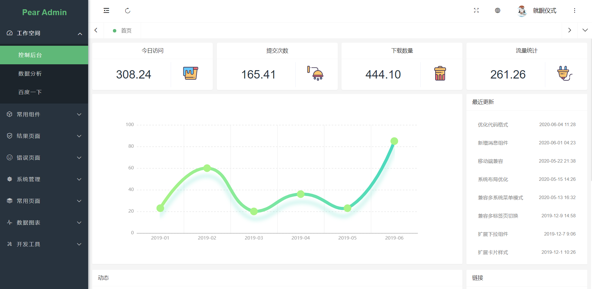
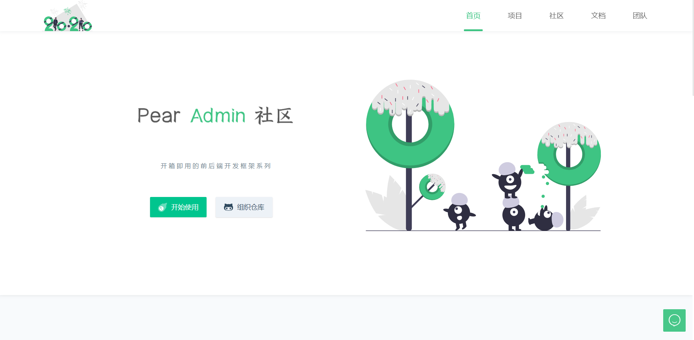

## 项目介绍  :id=start

Pear Admin Boot 基于 Spring Boot 2.0 的快速开发平台，通过代码生成，系统权限模块，即可快速构建你的功能业务。

> 当前版本：`Release v1.5.0`，查看 [在线演示](http://boot.pearadmin.com)。
 

## 下载使用  :id=download

#### 1. 官网地址

官网提供稳定版本的 Release 发行版本 [前往](http://www.pearadmin.com)

#### 2. 源码仓库

如果你需要最新代码，请前往 Gitee 仓库 [前往](https://gitee.com/pear-admin/Pear-Admin-Boot)

