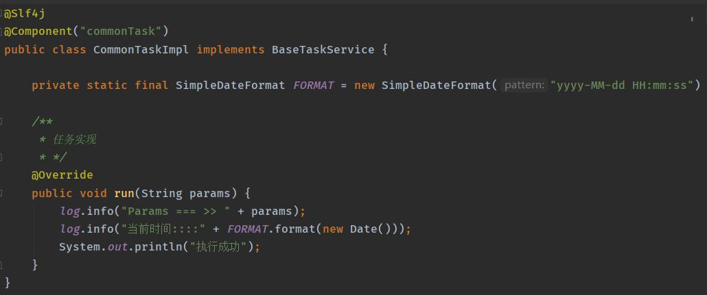
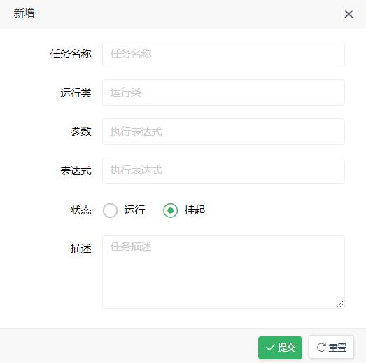

## 定时任务

对于简单的定时任务用 Spring的 @Scheduled 注解即可，如需要动态管理定时任务就需要使用到 Quartz。本系统的动态定时任务源码位于  pear-modules -> pear-schedule，使用流程如下

## 任务实现



## 创建任务

打开定时任务页面，点击新增按钮创建定时任务，部分参数解释如下：



任务名称：概述任务
运行类：Spring Bean名称，如： commonTask
参数：run(String params) 传递的参数
表达式：可查询官方cron表达式介绍
状态：是否启动定时任务
描述：任务的详细信息

## 常用配置

```
0 0 10,14,16 * * ? 每天上午10点，下午2点，4点 
0 0/30 9-17 * * ? 朝九晚五工作时间内每半小时 
0 0 12 ? * WED 表示每个星期三中午12点 
"0 0 12 * * ?" 每天中午12点触发 
"0 15 10 ? * *" 每天上午10:15触发 
"0 15 10 * * ?" 每天上午10:15触发 
"0 15 10 * * ? *" 每天上午10:15触发 
"0 15 10 * * ? 2005" 2005年的每天上午10:15触发 
"0 * 14 * * ?" 在每天下午2点到下午2:59期间的每1分钟触发 
"0 0/5 14 * * ?" 在每天下午2点到下午2:55期间的每5分钟触发 
"0 0/5 14,18 * * ?" 在每天下午2点到2:55期间和下午6点到6:55期间的每5分钟触发 
"0 0-5 14 * * ?" 在每天下午2点到下午2:05期间的每1分钟触发 
"0 10,44 14 ? 3 WED" 每年三月的星期三的下午2:10和2:44触发 
"0 15 10 ? * MON-FRI" 周一至周五的上午10:15触发 
"0 15 10 15 * ?" 每月15日上午10:15触发 
"0 15 10 L * ?" 每月最后一日的上午10:15触发 
"0 15 10 ? * 6L" 每月的最后一个星期五上午10:15触发 
"0 15 10 ? * 6L 2002-2005" 2002年至2005年的每月的最后一个星期五上午10:15触发 
"0 15 10 ? * 6#3" 每月的第三个星期五上午10:15触发
```

