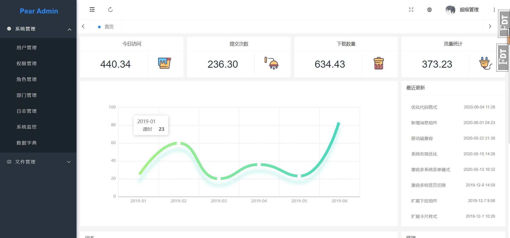

## 项目介绍  :id=start

Pear Admin Flask 基于 Flask 的后台管理系统，拥抱应用广泛的python语言，通过使用本系统，即可快速构建你的功能业务

项目旨在为python开发者提供一个后台管理系统的模板，成为您构建信息管理系统，物联网后台....等等应用时灵活，简单的工具

各位Python爱好者多多指教

> 当前版本：`Release v1.00`，查看 [在线演示](http://flask.pearadmin.com/)。

## 下载使用  :id=download

#### 1. 官网地址

官网提供稳定版本的 Release 发行版本 [前往](http://www.pearadmin.com)

#### 2. 源码仓库

如果你需要最新代码，请前往 Gitee 仓库 [前往](https://gitee.com/pear-admin/pear-admin-flask)

