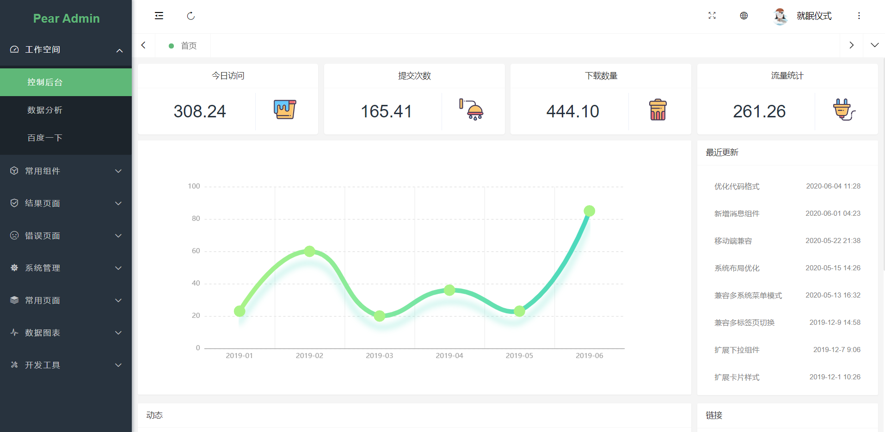
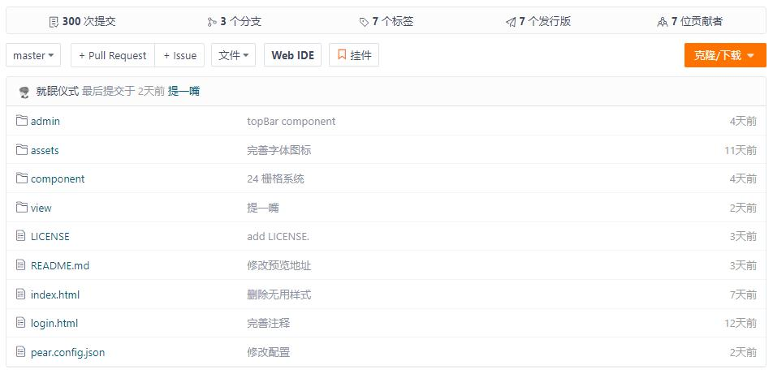

## 项目介绍  :id=start

Pear Admin Layui 是一个快速，简介且高效的前端框架，使用 Layui 开发，通过简单的初始化配置，即可生成符合您项目需求的布局与样式，提供大量开箱即用的前端组件

> 当前版本：`Release v3.8.7`，查看 [在线演示](http://layui.pearadmin.com)。
 

## 下载使用  :id=download

#### 1. 官网地址

官网提供稳定版本的 Release 发行版本 [前往](http://www.pearadmin.com)

#### 2. 源码仓库

如果你需要最新代码，请前往 Gitee 仓库 [前往](https://gitee.com/pear-admin/Pear-Admin-Layui)

