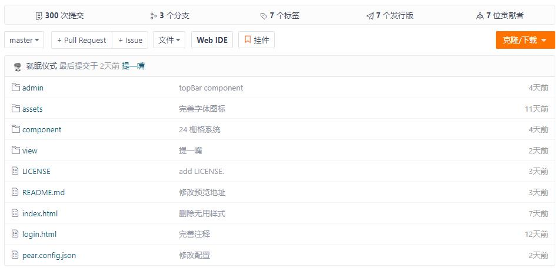

## 项目介绍  :id=start

Pear Admin Think 基于 Thinkphp 6 的快速开发平台，通过简单的代码生成功能，即可快速构建你的功能业务，提供大量开箱即用的前端组件

> 当前版本：`Release v1.0.0`，查看 [在线演示](http://192.144.214.203/admin.php/admin.login/index)。
 

## 下载使用  :id=download

#### 1. 官网地址

官网提供稳定版本的 Release 发行版本 [前往](http://www.pearadmin.com)

#### 2. 源码仓库

如果你需要最新代码，请前往 Gitee 仓库 [前往](https://gitee.com/pear-admin/Pear-Admin-Think)

