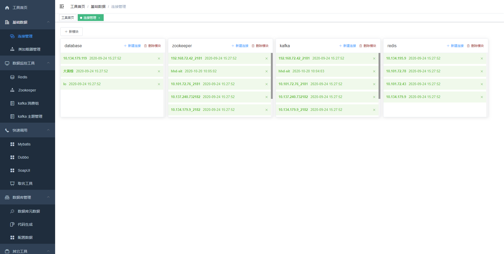
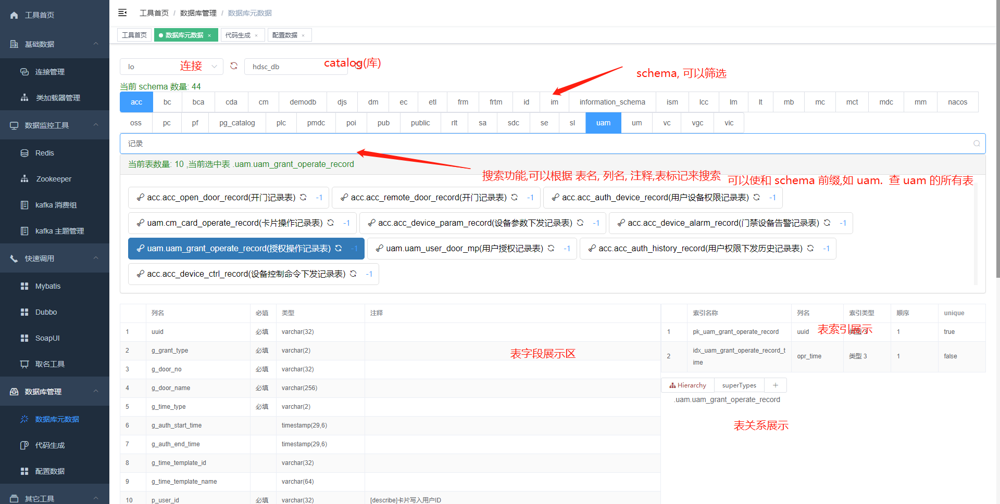
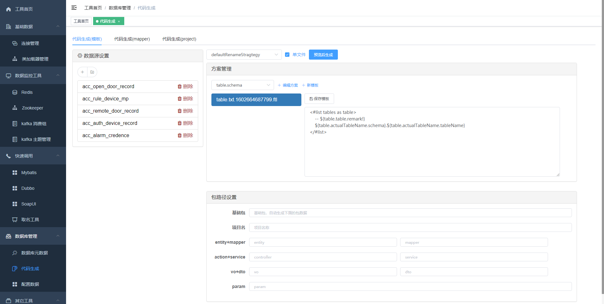
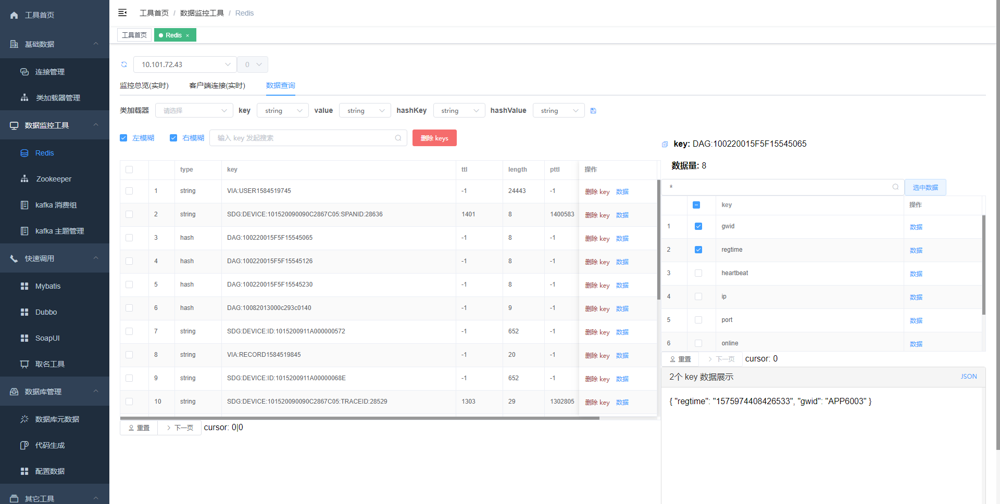
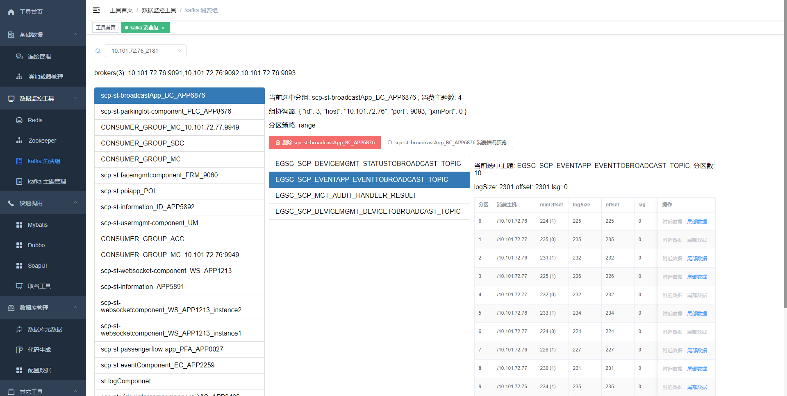

# 9420 开发工具包
---
sanri-tools-maven 是一个开源的用于企业开发的工具包，重点想解决项目开发中一些比较麻烦的问题

目前已经提供一些常用的工具,读者也可以开发自己的工具注册进来 ,欢迎 pr 或者提 issue 

博客地址: https://www.cnblogs.com/sanri1993/

## Giteye chart
[](https://giteye.net/chart/RMY45L94)

---

## 工具理念

1. 轻量级,只依赖于文件系统,无权限管理
2. 多模块,可插拨设计,只加载想要的工具
3. 做数据监控和数据的可视化工具,不像别的工具,这个可以直接看到数据明文,而不是乱码

## 已经有的工具,分模块展示
1. tools-core
   * 类加载管理 上传类 zip , class, java 文件到类加载器
   * 连接管理 创建 zookeeper, redis , database 等连接
   * 文件管理 系统的临时文件和配置文件的管理,提供临时文件下载功能 
   * 插件管理 插件注册,提供给前端可访问的插件,做了一个监控指标,根据插件点击次数和最后访问时间来排序插件
   * 数据管理 可以给 class 随机生成数据,使用正则表达式生成数据,和爬网站数据功能
2. tools-serializable
   * 提供序列化,反序列化等基础功能 
3. tools-zookeeper
   * zookeeper 连接的子节点,acl权限,节点数据,节点元数据,删除节点,写入数据
   * 路径收藏功能,方便下次直接查找
4. tools-redis
   * 支持集群,主从和单机,展示节点主机,端口,角色,父节点; 集群可以展示槽位分配 
   * key 列表查询,可以查询集群所有节点,hashKey 列表查询,key 的长度,ttl , type 展示
   * 查询某个 key 的数据,可以根据序列化和类加载器展示成友好的方式,支持(string,hash,list,set,zset)
   * 在线求 set 类型的数据交集,并集,差集
   * 监控每一个节点使用的内存信息
   * 监控每一个节点的连接数,主机占用连接数信息,杀掉某个连接
   * 监控每一个节点的慢查询
   * 注: 快速搜索功能不一定快速 , 做这个功能的目的是和精确数量来比较的,如果要精确数量,
   那我每次 scan 的 limit 参数必须较正, 一次搜索的数量就少了, 但如果不需要精确数量的话 , 我可以一次 limit 1000 条,可以加快搜索速度 , 
   这个适用于用户知道了很精确的 key ,对于一个有 100 万 key 的集群来说搜索会快很多
5. tools-kafka
   * 消费组列表,删除消费组,消费组消费的主题列表,消费组消费主题某分区消费数据情况,消费组消费主题某分区附近的数据
   * 主题列表,主题尾部数据,创建主题,删除主题,模拟数据发送
   * 主题数据实时监控,brokers 列表
   * 所有的数据消费或监控都可以使用序列化配合类加载器来展示数据明文
   * JMX 监控,详情见类 BrokerTopicMetrics 
6. tools-database
   * 数据库元数据 catalog,schema,表,列,索引,主键 查询和搜索
   * 扩展元数据 表类型(字典表,配置表,业务表),表关联关系设置,展示和搜索
   * 数据库文档生成和下载
   * 使用模板生成代码,组合模板成方案生成代码
   * 使用 sql 预览数据库数据和 excel 导出,导入 excel 数据 ,表随机数据生成 
   * nacos,diamond 等依赖于数据库的配置数据可以直接展示 
   * 强大的搜索功能,可以使用表名,列名,注释,表标记,schema 来搜索表
   * 随机数据插入,在压力测试时可以用 , 可以用 spring 表达式,正则,关联另一张表来随机生成表数据
7. tools-mybatis
   * 上传 mapper 文件,配合类加载器,可以找到所有的 mapper 文件中的所有 statementId
   * 根据 statementId 可以知道当前 statementId 所必传的参数
   * 传入必传参数,和数据库连接,可以直接调用 statementId, 得到 sql 语句 ,这里的数据库连接引用数据库模块的连接名
8. tools-swagger-doc
   * 将 swagger 的文档生成更美观的文档并提供下载文档
   * 注意: 这个工具尚不完善,输入框填入网络请求中 json 数据那个链接
9. tools-dubbo
   * 依赖于 zookeeper 模块,得到 dubbo 的提供者,获取提供的方法,并可以执行调用
10. tools-name
    * 想要给某个方法取名,但一下子想不到合适的名字,可以用这个工具帮你取名
    * 支持设置业务词,ik 分词,英语翻译
11. tools-soap
    * 支持 soap 调用
12. tools-websocket
    * 主要是给其它模块提供前端推送数据功能 
13. tools-quartz
    * 触发器和任务列表,cron 表达式以及后面 10 次的任务执行时间
    * 触发,停止,恢复,需要配合类加载器
    * 新建,移除任务,需要配合类加载器
14. tools-mongodb
    * 数据库列表,集合列表
    * 数据查询
15. tools-elasticsearch
    * 计划中,欢迎网友提供需求
    
### 每一个模块的使用文档
对于一个工具来说,使用文档是比较重要的,使用文档放到每个模块的 resources 中, 然后通过 PluginManager 注册进来

在首页会读取使用文档,并展示给用户,你可以在 md 文件中做外链,以便链接外部说明文档

#### 说明下注意事项,对于刚开始使用这个工具的人来说
1. 连接管理中的模块名必须是固定的,只能取 database,kafka,redis,zookeeper,mongo 具体可以在 ConnectService.moduleParamFactory() 方法中查看
2. 数据库类型只支持 mysql,postgresql,oracle 具体可以在 DatabaseConnectParam 中查看
3. 类加载器 "上传 dto" 可以是单类文件,无目录结构,java 实体类,但不能是标准结构的; "上传标准 dto" 只能是标准结构类文件
4. 新建连接是有模板的,如果模板没有加载出来,检查模块名是否正确,可以重新打开来加载配置模板

### 工具模块间依赖关系,扩展自己的工具时可能需要用到

```
tools-core
 |- tools-serializable
 
tools-zookeeper
 |- tools-core

tools-kafka 
 |- tools-zookeeper
 |- tools-websocket
  
tools-dubbo
 |- tools-zookeeper
 
tools-redis
 |- tools-core
   
tools-database
 |- tools-core

tools-swagger-doc
 |- tools-core

tools-mybatis 
 |- tools-database

tools-name
 |- tools-core
 
tools-soap
 |- tools-core
```

## 如何运行

### 方式一下载源码启动 
* issue 因为 tools-name 模块中的 ik 分词在中央仓库是没有的,所以你如果不需要这个模块,可以直接删除此模块, 或者你想要这个模块可以安装 ik 分词依赖,包和安装脚本都在 tools-name/src/main/resources 中 

解决 ik 分词问题后,就可以直接运行 tools-console 中的 com.sanri.tools.Application 启动 ,标准的 springboot 项目

### 方式二下载 release 启动

[https://gitee.com/sanri/sanri-tools-maven/releases](https://gitee.com/sanri/sanri-tools-maven/releases)

@since 2.0.0  java -jar sanritools.jar 

2.0.0 版本之前,下载的 release 为 tomcat ,双击 bin/start.bat 启动

**如何查看当前正在开发的工具版本**

当前工具的版本在 tools-console/src/main/resources/version 文件中, 各模块的版本后面会写在 pluginDto 中注册进来

### 方式三 , 前端嵌入后台中启动 (推荐)
这种方式适合于后端人员需要调试工具时使用; 

* 在 tools-console/src/main 文件夹中建一个目录 webapp ,并标识为 web 
* 解压 tools-console/webapp.zip 放到上一步建的 webapp 目录
* 运行 tools-console 中的 Application.main() , 就可以做后台的开发调试了
* 访问路径  http://localhost:8084

注: tools-console 的 webapp.zip 是一个比较旧的版本(20201211),后面的打包版本会放在[前端项目Release](https://gitee.com/sanri/sanritoolsvue/releases)

## 如何扩展自己的工具
新增一个模块,如 tools-xxx ,然后依赖于 tools-core 
```xml
<dependency>
    <groupId>${project.groupId}</groupId>
    <artifactId>tools-core</artifactId>
    <version>${project.version}</version>
</dependency>
```
最后将模块使用插件管理注册进来
```java
@Autowired
private PluginManager pluginManager;

@PostConstruct
public void register(){
    pluginManager.register(PluginDto.builder().module("tools-xxx").name("main").build());
}
```
module 在前端是做为一级菜单,然后 name 是二级菜单 , 同一个模块下可以注册多个功能项, 插件的开发和工作中开发 controller 没有区别 

### 关于单元测试
工具使用了更方便的单元测试,直接发送 http 请求来测试,所有的单元测试都在 requests/全部 http 请求.http 中

### 关于项目前端
官方前端 [https://gitee.com/sanri/sanritoolsvue](https://gitee.com/sanri/sanritoolsvue)

前端美图 [https://gitee.com/sanri/sanri-tools-maven/issues/I1UEJR](https://gitee.com/sanri/sanri-tools-maven/issues/I1UEJR)

如果对这个前端不满意,可以使用接口进行自定义开发, 本项目只是提供数据服务

#### 界面美图












### 数据库的文档生成

数据库文档生成，每个公司要求的模板都不一样，可以自己扩展，使用 jdbcService 可以拿到你想要的元数据，然后想怎么生成，全靠你自己， 我这里提供了三个示例
* 生成 markdown 的 ，使用 database-doc.md.ftl 模板
* 生成 html 的，使用 database-doc.html.ftl 模板
* 生成 excel 的，实现类在 MetadataControllerShow.generate() 方法中

### 代码生成的元数据结构
做为一个sanri工具最早提供的功能，这个功能在网上有很多类似的实现，基本可以分为两类，一类是直接帮你生成固定的模式，只适应于它的项目模板，一类是提供使用模板生成的方式
这两种方式各有利弊，为了省事，一般使用直接生成可用的代码，如果需要二次开发最好是使用模板生成，这里我两种都有提供

尽管我已经提供了相当多的模板，但还是有需要自定义模板代码生成的用户，不可能全部穷尽，这里我把可以给到模板中的元数据结构，模板目前只支持 freemarker 

1. 通用数据,不管是 javaBean、模板代码、还是项目构建都会有这个数据 
```
author      : 当前作者，取计算机名 
date        : 当前日期 yyyy-MM-dd 
time        : 当前时间 HH:mm:ss
```

2. javaBean 构建时数据 
```
bean        : 当前表对应的 java 实体类信息 ,引用类 JavaBeanInfo
beanConfig  : bean 的配置信息,引用类 JavaBeanBuildConfig
table       : 表元数据信息,引用类 TableMetaData
```

3. 模板代码生成(每一个模板都是针对单张表的生成)
```
bean        : 当前表对应的 java 实体类信息 ,引用类 JavaBeanInfo
table       : 表元数据信息,引用类 TableMetaData
codeConfig  : 如果是模板代码生成 ,引用 CodeGeneratorParam
```

4. 项目构建数据
```
tables      : 表元数据信息,引用类 TableMetaData:List
beans       : 当前表对应的 java 实体类信息 ,引用类 JavaBeanInfo:List
config      : 如果是项目构建,引用 CodeGeneratorConfig
dataSource  : 数据源,引用类 ConnectionMetaData
```

## 如何交流、反馈、参与贡献？

* Git仓库：https://gitee.com/sanri/sanri-tools-maven
* 官方前端：[https://gitee.com/sanri/sanritoolsvue](https://gitee.com/sanri/sanritoolsvue)
* 技术讨论、二次开发等咨询、问题和建议，请移步到微信群，我会在第一时间进行解答和回复
* 如需关注项目最新动态，请Watch、Star项目，同时也是对项目最好的支持
* 微信扫码并关注我，获得项目最新动态及更新提醒,拉你进入微信技术群
* 如果有需要支持的中间件,可以提交 pr , 或者微信联系我


