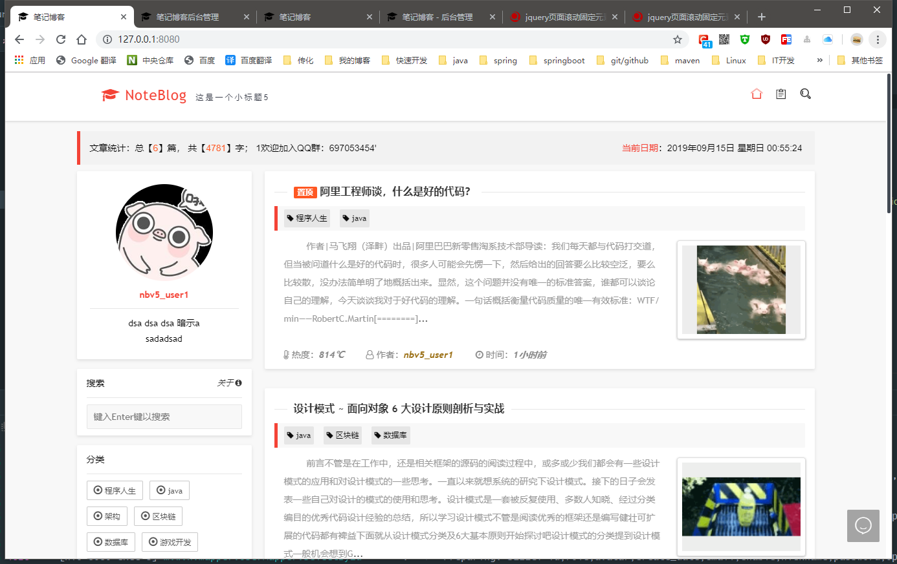
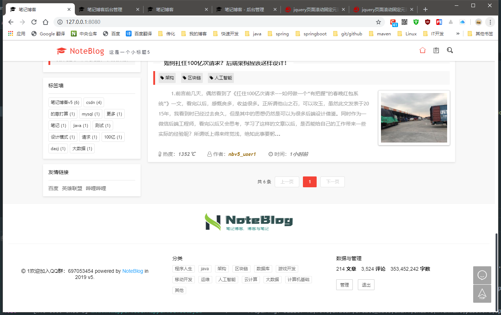
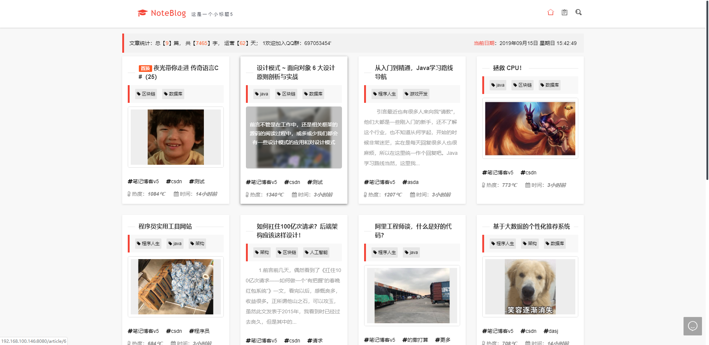
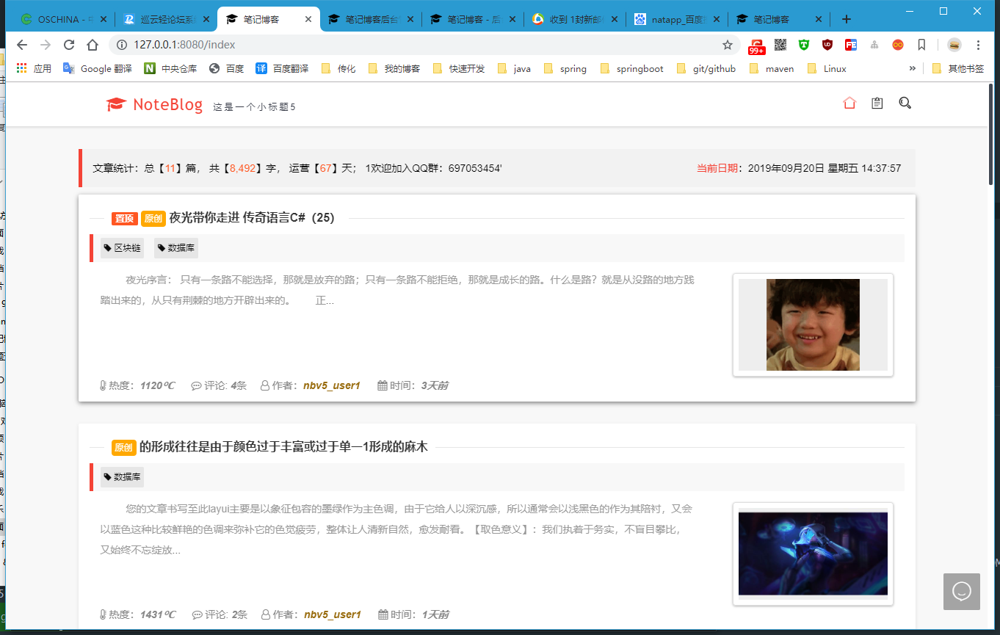
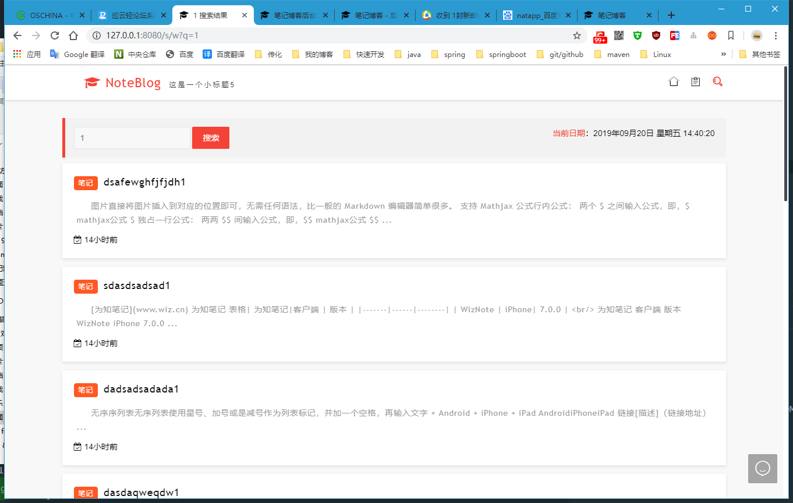
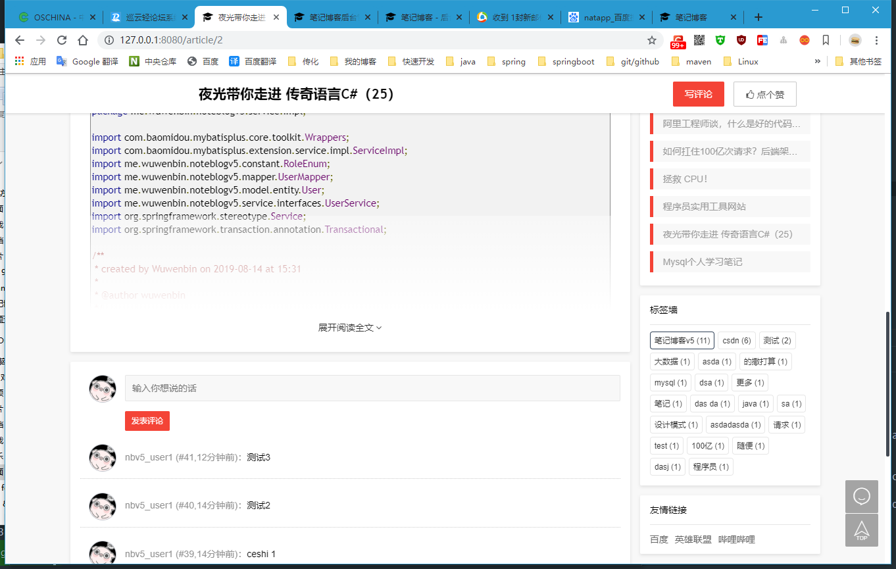
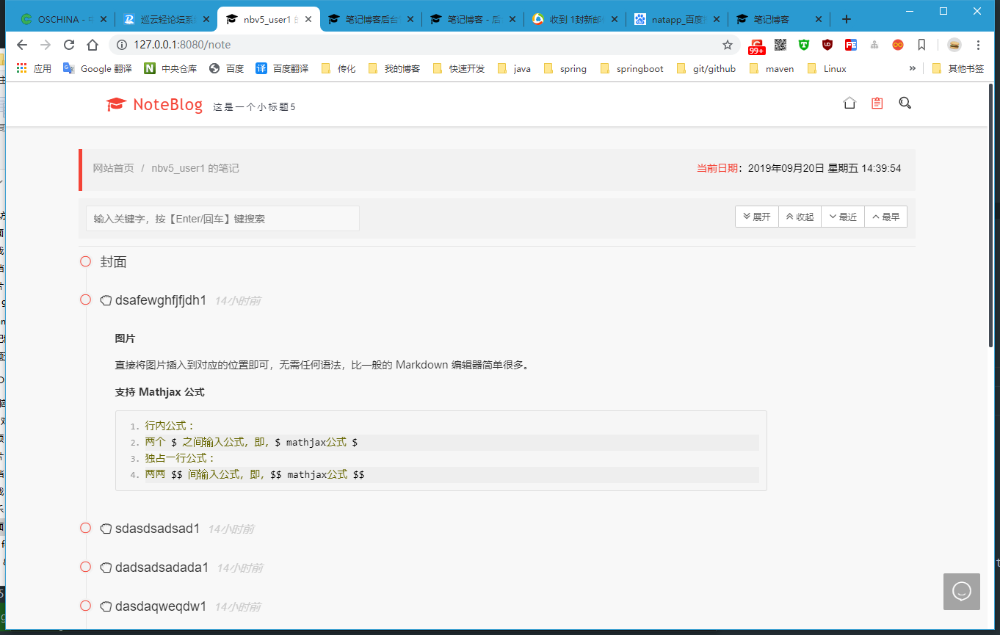

点击入群【[笔记博客 ~ 交流反馈：697053454](https://jq.qq.com/?_wv=1027&k=5ZEGGl8)】，获取SQL文件（群文件中即可下载）

## 广告一下
> 说明：当前项目是【noteblogv5】是开源的，【notepress】为当前项目的重构升级版，具有更多特性
- 船新升级版【NotePress】 ，请点击<a href="http://notepress.wuwenbin.me" target="_blank"> 链接1</a> 或 <a href="http://notepress.vip" target="_blank">链接2</a> 查看
- 版本对比：[点我](https://wuwenbin.me/content/u/buynotepress) 查看 
- 授权地址：[点我](https://wuwenbin.me/content/u/npbuy) 前往授权
---
## v5的一些改动和升级
1. jpa --> mybatis-plus，更易上手
2. 升级 layui 版本和 springboot 版本
3. 后台管理UI升级为LayuiAdmin
4. 全面删除内嵌使用的vue部分功能，纯净js+html模板
5. 简化一些不必要的代码（包含java部分和js）
6. 更简单的发布配置以及更简洁的配置说明
7. 后台一些配置管理更加清晰易上手
8. 增加添加页面模板的功能（可能放到小版本上）
9. 增加隐藏内容（提供回复可见、登录可见以及购买可见）
10. 支持emoji
11. 新增用户中心模块
12. 多种风格配置功能
13. 增加评论留言邮件回复
14. 更多请自行体验，最新信息请加入qq群讨论：697053454

> 截图预览的在底部，请往下翻看

## 部署教程
1. 新建 noteblogv5数据库，导入db.sql脚本文件(加群，群文件可以下载sql)
2. 采用 nohup java -jar noteblogv5.jar >noteblogv5.log 2>&1 & 后台服务启动即可

## 更新日志
### v5.9.3
[√] 修复mapper 参数找不到的错误 
[√] 修复启动可能存在抛出nep的异常
### v5.9.2
[^] 优化初始化JDBC的连接属性
### v5.9.1
[√] 修复文章评论出回复的一处可能会造成评论失败的BUG
### v5.9
[+] 新增seo优化配置，包含关键字和描述
[^] 优化访问量的统计PV和UV
### v5.8.7
[√] 修复添加下载资源标题时长度提示的错误
[√] 修复编辑下载资源时，密码/提取码为必填的提示
[√] 修复一个页面多个编辑器ID冲突的问题
[√] 修复检查更新的跨域问题
### v5.8.3
[^] 优化卡密的生成操作
[^] 优化七牛云上传的空间配置代码
[^] 优化代码规范
### v5.8
[+] 新增网站欢迎页，提供4个卡片进行配置  
[+] 新增检测更新的功能，请前往管理后台控制台右上方进行操作  
[+] 新增云文件分享下载的功能的页面模块  
[+] 新增用户被回复时，可根据用户的邮箱进行邮件提醒  
[+] 新增留言榜和评论榜的显示  
[^] 优化文章卡片日期的显示（由创建日期改为更新日期） 
[^] 优化数据库链接URL配置，现在可以自定义url链接  
[^] 优化网站背景图显示  
[^] 优化html的页面代码，采用片段插入  
[^] 优化文章的评论楼层显示  
[^] 优化添加/编辑文章的分类数目的判断  
[^] 优化添加文章页面的排版显示  
[^] 优化本地服务器上传文件夹位置的处理，现在可以有默认配置了，默认在jar的同级文件夹下  
[√] 修复添加隐藏内容是总是插入文章末尾的BUG  
[√] 修复更新文章时候文章的日期不更新的问题  
[√] 修复用户中心用户头像上传失败的BUG  
### v5.3.11.8
[√] 修复更新文章时，重复插入隐藏内容的BUG  
[√] 修复文章详细页面评论总数显示错误的BUG  
### v5.3.11.6
[+] 新增首页的分类查询显示  
[^] 优化登录界面和注册界面的LOGO文字，显示为网站LOGO的相同文字  
[√] 修复更新文章时自定义url清空的BUG  
### v5.2.10.5
[+] 新增文章时候，可以直接新增分类  
[+] 新增定时删除无效多余的上传文件/图片  
[^] 优化上传代码，简化上传代码逻辑  
[^] 优化设置的提交功能，现在可以多个项目一起提交  
[^] 优化后台管理移动手机模式侧边栏  
[^] 优化safari浏览器顶部导航栏的动画效果  
[^] 优化后台统计图的显示，地域名字优化  
[^] 优化移动端的后台管理的界面排版  
[^] 优化文章添加时二维码的提醒  
[^] 优化站长认证标识的显示位置  
[^] 优化微调编辑器选项提示的位置  
[^] 优化文章设置中打赏功能的提示  
[√] 修复文章的评论功能设置无效的BUG  
[√] 修复修改文章的自定义url会被覆盖不会更新的BUG  
[√] 修复文章数量较少时侧边static栏错位的BUG  
[√] 修复某些情况下参数缓存实效的BUG  
[√] 修复提交个人设置时会影响邮箱设置的BUG  

---
## 截图预览

